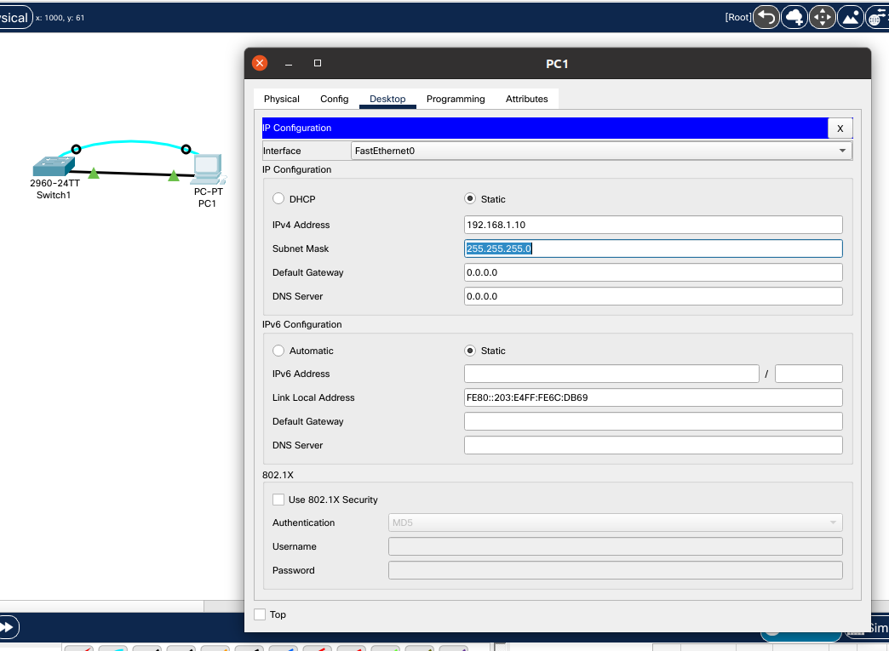

## Задачи

1. Создание сети и проверка конфигурации коммутатора по умолчанию.
2. Настройка основных параметров устройства.
3. Проверка сетевых подключений.

## 1. Создание сети и проверка конфигурации коммутатора по умолчанию

### 1.1 Создайте сеть согласно топологии

* Подсоедините консольный кабель, как показано в топологии. На данном этапе не подключайте кабель Ethernet компьютера PC-A.
* Установите консольное подключение к коммутатору с компьютера PC-A с помощью Tera Term или другой программы эмуляции терминала.


### ???

> Почему нужно использовать консольное подключение для первоначальной настройки коммутатора? Почему нельзя подключиться к коммутатору через Telnet или SSH?

Для первончальной настройки коммутатора существует единственный способ - подключение через консоль. 
Затем можно настроить виртуальные терминальные линии (vty), чтобы впоследствии подключаться удалённо через Telnet или SSH.

### 1.2 Проверьте настройки коммутатора по умолчанию

* Предположим, что коммутатор не имеет файла конфигурации, сохраненного в энергонезависимой памяти (NVRAM). Консольное подключение к коммутатору с помощью Tera Term или другой программы эмуляции терминала предоставит доступ к командной строке пользовательского режима EXEC в виде Switch>. Введите команду enable, чтобы войти в привилегированный режим EXEC.  

  Обратите внимание, что измененная в конфигурации строка будет отражать привилегированный режим EXEC.  

  Убедитесь, что на коммутаторе находится пустой файл конфигурации по умолчанию, с помощью команды show running-config привилегированного режима EXEC. Если конфигурационный файл был предварительно сохранен, его нужно удалить. В зависимости от модели коммутатора и версии IOS ваша конфигурация может слегка отличаться. Тем не менее, настроенных паролей или IP-адресов в конфигурации быть не должно. Выполните очистку настроек и перезагрузите коммутатор, если ваш коммутатор имеет настройки, отличные от настроек по умолчанию.

```shell
Switch>enable
Switch#
Switch#show running-config 
Building configuration...

Current configuration : 1080 bytes
!
version 15.0
no service timestamps log datetime msec
no service timestamps debug datetime msec
no service password-encryption
!
hostname Switch
!
!
!
!
!
!
spanning-tree mode pvst
spanning-tree extend system-id
!
interface FastEthernet0/1
!
interface FastEthernet0/2
!
interface FastEthernet0/3
!
interface FastEthernet0/4
!
interface FastEthernet0/5
!
interface FastEthernet0/6
!
interface FastEthernet0/7
!
interface FastEthernet0/8
!
interface FastEthernet0/9
!
interface FastEthernet0/10
!
interface FastEthernet0/11
!
interface FastEthernet0/12
!
interface FastEthernet0/13
!
interface FastEthernet0/14
!
interface FastEthernet0/15
!
interface FastEthernet0/16
!
interface FastEthernet0/17
!
interface FastEthernet0/18
!
interface FastEthernet0/19
!
interface FastEthernet0/20
!
interface FastEthernet0/21
!
interface FastEthernet0/22
!
interface FastEthernet0/23
!
interface FastEthernet0/24
!
interface GigabitEthernet0/1
!
interface GigabitEthernet0/2
!
interface Vlan1
 no ip address
 shutdown
!
!
!
!
line con 0
!
line vty 0 4
 login
line vty 5 15
 login
!
!
!
!
end


Switch#
```

* Изучите текущий файл running configuration.

### ???

> Сколько интерфейсов FastEthernet имеется на коммутаторе 2960?

24 (interface FastEthernet0/1 - interface FastEthernet0/24).

> Сколько интерфейсов Gigabit Ethernet имеется на коммутаторе 2960?

2 (interface GigabitEthernet0/1 - interface GigabitEthernet0/2).

> Каков диапазон значений, отображаемых в vty-линиях?

```shell
line vty 0 4
 login
line vty 5 15
 login
```

16 (от 0 до 15).

* Изучите файл загрузочной конфигурации (startup configuration), который содержится в энергонезависимом ОЗУ (NVRAM).

```shell
Switch#show startup-config 
startup-config is not present
Switch#
```

### ???

> Почему появляется это сообщение?

При первоначальной настройке коммутатора дефолтной конфигурации не существует (пока самостоятельно её не сохраним).

* Изучите характеристики SVI для VLAN 1.

```shell
Switch#show interfaces Vlan 1
Vlan1 is administratively down, line protocol is down
  Hardware is CPU Interface, address is 0001.96b4.e213 (bia 0001.96b4.e213)
  MTU 1500 bytes, BW 100000 Kbit, DLY 1000000 usec,
     reliability 255/255, txload 1/255, rxload 1/255
  Encapsulation ARPA, loopback not set
  ARP type: ARPA, ARP Timeout 04:00:00
  Last input 21:40:21, output never, output hang never
  Last clearing of "show interface" counters never
  Input queue: 0/75/0/0 (size/max/drops/flushes); Total output drops: 0
  Queueing strategy: fifo
  Output queue: 0/40 (size/max)
  5 minute input rate 0 bits/sec, 0 packets/sec
  5 minute output rate 0 bits/sec, 0 packets/sec
     1682 packets input, 530955 bytes, 0 no buffer
     Received 0 broadcasts (0 IP multicast)
     0 runts, 0 giants, 0 throttles
     0 input errors, 0 CRC, 0 frame, 0 overrun, 0 ignored
     563859 packets output, 0 bytes, 0 underruns
     0 output errors, 23 interface resets
     0 output buffer failures, 0 output buffers swapped out

Switch#
```

### ???

> Назначен ли IP-адрес сети VLAN 1?

? Нет.

> Какой MAC-адрес имеет SVI? Возможны различные варианты ответов.

? `address is 0001.96b4.e213 (bia 0001.96b4.e213)`

> Данный интерфейс включен?

? Нет. `Vlan1 is administratively down, line protocol is down`

* Изучите IP-свойства интерфейса SVI сети VLAN 1.

### ???

> Какие выходные данные вы видите?

?

* Подсоедините кабель Ethernet компьютера PC-A к порту 6 на коммутаторе и изучите IP-свойства интерфейса SVI сети VLAN 1.
Дождитесь согласования параметров скорости и дуплекса между коммутатором и ПК.

> Какие выходные данные вы видите?

?

* Изучите сведения о версии ОС Cisco IOS на коммутаторе.

```shell
Switch#show version
Cisco IOS Software, C2960 Software (C2960-LANBASEK9-M), Version 15.0(2)SE4, RELEASE SOFTWARE (fc1)
Technical Support: http://www.cisco.com/techsupport
Copyright (c) 1986-2013 by Cisco Systems, Inc.
Compiled Wed 26-Jun-13 02:49 by mnguyen

ROM: Bootstrap program is C2960 boot loader
BOOTLDR: C2960 Boot Loader (C2960-HBOOT-M) Version 12.2(25r)FX, RELEASE SOFTWARE (fc4)

Switch uptime is 39 minutes
System returned to ROM by power-on
System image file is "flash:c2960-lanbasek9-mz.150-2.SE4.bin"


This product contains cryptographic features and is subject to United
States and local country laws governing import, export, transfer and
use. Delivery of Cisco cryptographic products does not imply
third-party authority to import, export, distribute or use encryption.
Importers, exporters, distributors and users are responsible for
compliance with U.S. and local country laws. By using this product you
agree to comply with applicable laws and regulations. If you are unable
to comply with U.S. and local laws, return this product immediately.

A summary of U.S. laws governing Cisco cryptographic products may be found at:
http://www.cisco.com/wwl/export/crypto/tool/stqrg.html

If you require further assistance please contact us by sending email to
export@cisco.com.

cisco WS-C2960-24TT-L (PowerPC405) processor (revision B0) with 65536K bytes of memory.
Processor board ID FOC1010X104
Last reset from power-on
1 Virtual Ethernet interface
24 FastEthernet interfaces
2 Gigabit Ethernet interfaces
The password-recovery mechanism is enabled.

64K bytes of flash-simulated non-volatile configuration memory.
Base ethernet MAC Address       : 00:17:59:A7:51:80
Motherboard assembly number     : 73-10390-03
Power supply part number        : 341-0097-02
Motherboard serial number       : FOC10093R12
Power supply serial number      : AZS1007032H
Model revision number           : B0
Motherboard revision number     : B0
Model number                    : WS-C2960-24TT-L
System serial number            : FOC1010X104
Top Assembly Part Number        : 800-27221-02
Top Assembly Revision Number    : A0
Version ID                      : V02
CLEI Code Number                : COM3L00BRA
Hardware Board Revision Number  : 0x01


Switch Ports Model              SW Version            SW Image
------ ----- -----              ----------            ----------
*    1 26    WS-C2960-24TT-L    15.0(2)SE4            C2960-LANBASEK9-M


Configuration register is 0xF


Switch#
```

### ???

> Под управлением какой версии ОС Cisco IOS работает коммутатор?

`Cisco IOS Software, C2960 Software (C2960-LANBASEK9-M), Version 15.0(2)SE4, RELEASE SOFTWARE (fc1)`

> Как называется файл образа системы?

`System image file is "flash:c2960-lanbasek9-mz.150-2.SE4.bin"`

> Какой базовый MAC-адрес назначен коммутатору?

`Base ethernet MAC Address       : 00:17:59:A7:51:80`

* Изучите свойства по умолчанию интерфейса FastEthernet, который используется компьютером PC-A.

```shell
Switch#show interfaces f0/6
FastEthernet0/6 is up, line protocol is up (connected)
  Hardware is Lance, address is 00d0.975c.3606 (bia 00d0.975c.3606)
 BW 100000 Kbit, DLY 1000 usec,
     reliability 255/255, txload 1/255, rxload 1/255
  Encapsulation ARPA, loopback not set
  Keepalive set (10 sec)
  Full-duplex, 100Mb/s
  input flow-control is off, output flow-control is off
  ARP type: ARPA, ARP Timeout 04:00:00
  Last input 00:00:08, output 00:00:05, output hang never
  Last clearing of "show interface" counters never
  Input queue: 0/75/0/0 (size/max/drops/flushes); Total output drops: 0
  Queueing strategy: fifo
  Output queue :0/40 (size/max)
  5 minute input rate 0 bits/sec, 0 packets/sec
  5 minute output rate 0 bits/sec, 0 packets/sec
     956 packets input, 193351 bytes, 0 no buffer
     Received 956 broadcasts, 0 runts, 0 giants, 0 throttles
     0 input errors, 0 CRC, 0 frame, 0 overrun, 0 ignored, 0 abort
     0 watchdog, 0 multicast, 0 pause input
     0 input packets with dribble condition detected
     2357 packets output, 263570 bytes, 0 underruns
     0 output errors, 0 collisions, 10 interface resets
     0 babbles, 0 late collision, 0 deferred
     0 lost carrier, 0 no carrier
     0 output buffer failures, 0 output buffers swapped out

Switch#
```

> Интерфейс включен или выключен?

Включён: `FastEthernet0/6 is up, line protocol is up (connected)`

> Что нужно сделать, чтобы включить интерфейс?

? Автоматически включается при подсоединении кабеля.

> Какой MAC-адрес у интерфейса?

`address is 00d0.975c.3606 (bia 00d0.975c.3606)`

> Какие настройки скорости и дуплекса заданы в интерфейсе?

`Full-duplex, 100Mb/s`

* Изучите параметры сети VLAN по умолчанию на коммутаторе.

```shell
Switch#show vlan brief

VLAN Name                             Status    Ports
---- -------------------------------- --------- -------------------------------
1    default                          active    Fa0/1, Fa0/2, Fa0/3, Fa0/4
                                                Fa0/5, Fa0/6, Fa0/7, Fa0/8
                                                Fa0/9, Fa0/10, Fa0/11, Fa0/12
                                                Fa0/13, Fa0/14, Fa0/15, Fa0/16
                                                Fa0/17, Fa0/18, Fa0/19, Fa0/20
                                                Fa0/21, Fa0/22, Fa0/23, Fa0/24
                                                Gig0/1, Gig0/2
1002 fddi-default                     active    
1003 token-ring-default               active    
1004 fddinet-default                  active    
1005 trnet-default                    active    
Switch#
```

> Какое имя присвоено сети VLAN 1 по умолчанию?

"default"

> Какие порты расположены в сети VLAN 1?

Fa0/1-24
Gig0/1-2

> Активна ли сеть VLAN 1?

Да.

> К какому типу сетей VLAN принадлежит VLAN по умолчанию?

?

* Изучите флеш-память.

```shell
Switch#show flash
Directory of flash:/

    1  -rw-     4670455          <no date>  2960-lanbasek9-mz.150-2.SE4.bin

64016384 bytes total (59345929 bytes free)
Switch#
```

> Какое имя присвоено образу Cisco IOS?

`2960-lanbasek9-mz.150-2.SE4.bin`

## 2. Настройка базовых параметров сетевых устройств

Во второй части необходимо будет настроить основные параметры коммутатора и компьютера.

### 2.1 Настройте базовые параметры коммутатора.

* В режиме глобальной конфигурации скопируйте следующие базовые параметры конфигурации и вставьте их в файл на коммутаторе S1.

```shell
Switch#conf t
Enter configuration commands, one per line.  End with CNTL/Z.
Switch(config)#no ip do
Switch(config)#no ip domain-lookup 
Switch(config)#hostname S1
S1(config)#service password-encryption 
S1(config)#enable secret class
S1(config)#banner motd #
Enter TEXT message.  End with the character '#'.
Unauthorized access is strictly prohibited. #

S1(config)#
```

* Назначьте IP-адрес интерфейсу SVI на коммутаторе. Благодаря этому вы получите возможность удаленного управления коммутатором.

```shell
S1(config)#interface vlan 1
S1(config-if)#ip address 192.168.1.2 255.255.255.0
S1(config-if)#no shutdown

S1(config-if)#
%LINK-5-CHANGED: Interface Vlan1, changed state to up

%LINEPROTO-5-UPDOWN: Line protocol on Interface Vlan1, changed state to up

S1(config-if)#
```

* Доступ через порт консоли также следует ограничить  с помощью пароля. Используйте cisco в качестве пароля для входа в консоль в этом задании. 
Конфигурация по умолчанию разрешает все консольные подключения без пароля. Чтобы консольные сообщения не прерывали выполнение команд, 
используйте параметр logging synchronous.

```shell
S1(config-if)#line console 0
S1(config-line)#password cisco
S1(config-line)#login
S1(config-line)#logging synchronous
S1(config-line)#
```

* Настройте каналы виртуального соединения для удаленного управления (vty), чтобы коммутатор разрешил доступ через Telnet. 
Если не настроить пароль VTY, будет невозможно подключиться к коммутатору по протоколу Telnet.

```shell
S1(config-line)#line vty 0 4
S1(config-line)#password cisco
S1(config-line)#
```

> Для чего нужна команда login?

Активирует аутентификацию к vty.

### 2.2 Настройте IP-адрес на компьютере PC-A.

Назначьте компьютеру IP-адрес и маску подсети в соответствии с таблицей адресации.



## 3. Проверка сетевых подключений
