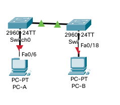
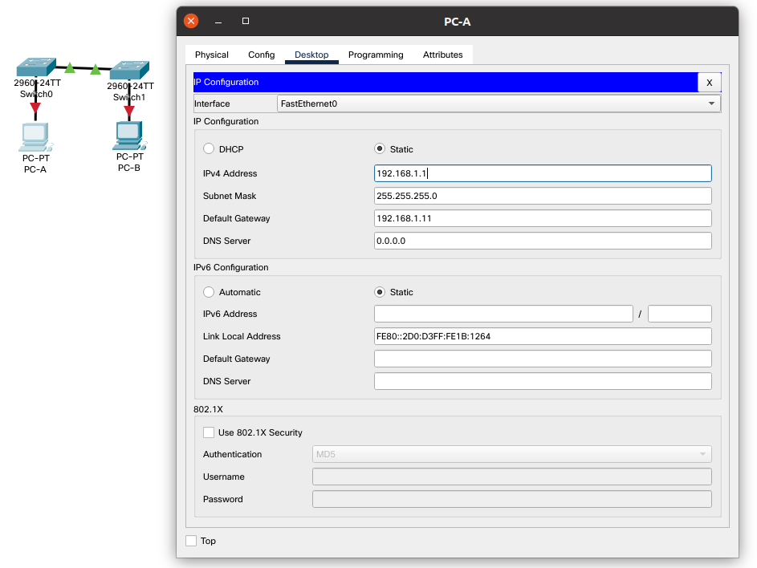
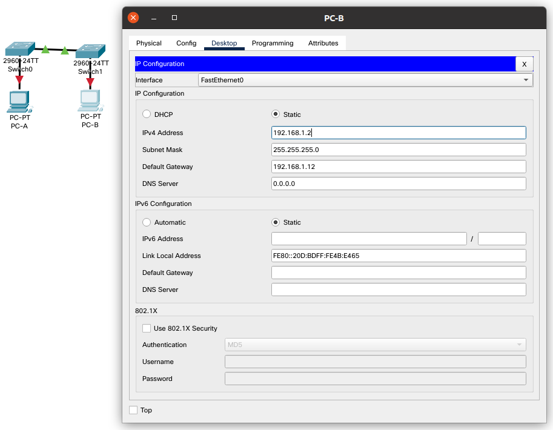
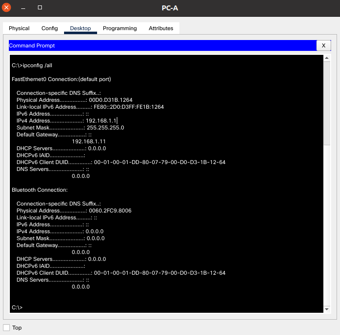
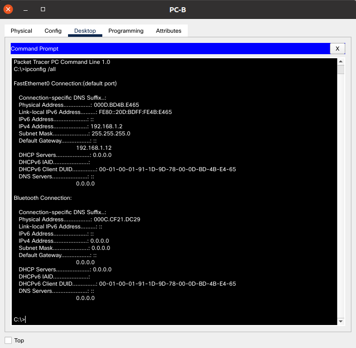

# Просмотр таблицы MAC-адресов коммутатора

## 1. Создание и настройка сети

### 1.1 Подключите сеть в соответствии с топологией.



### 1.2 Настройте узлы ПК.

PC-A:



PC-B:



### 1.3 Выполните инициализацию и перезагрузку коммутаторов.

> Пропускаю шаг, потому что делаю в виртуальной среде.

### 1.4 Настройте базовые параметры каждого коммутатора.

a. Настройте имена устройств в соответствии с топологией.
b. Настройте IP-адреса, как указано в таблице адресации.
c. Назначьте cisco в качестве паролей консоли и VTY.
d. Назначьте class в качестве пароля доступа к привилегированному режиму EXEC.

S1:

```shell
S1(config)#hostname S1
S1(config)#no ip domain-lookup 
S1(config)#service password-encryption 
S1(config)#banner motd #
Enter TEXT message.  End with the character '#'.
Unauthorized access is strictly prohibited. #

S1(config)#
S1(config)#interface Vlan 1
S1(config-if)#ip address 192.168.1.11 255.255.255.0
S1(config-if)#no shutdown
S1(config-if)#exit
S1(config)#line console 0
S1(config-line)#password cisco
S1(config-line)#login
S1(config-line)#exit
S1(config)#line vty 0 4
S1(config-line)#password cisco
S1(config-line)#login
S1(config-line)#exit
S1(config)#enable secret class
S1(config)#
```

S2:

```shell
S1(config)#hostname S2
S1(config)#no ip domain-lookup 
S1(config)#service password-encryption 
S1(config)#banner motd #
Enter TEXT message.  End with the character '#'.
Unauthorized access is strictly prohibited. #

S1(config)#
S1(config)#interface Vlan 1
S1(config-if)#ip address 192.168.1.12 255.255.255.0
S1(config-if)#no shutdown
S1(config-if)#exit
S1(config)#line console 0
S1(config-line)#password cisco
S1(config-line)#login
S1(config-line)#exit
S1(config)#line vty 0 4
S1(config-line)#password cisco
S1(config-line)#login
S1(config-line)#exit
S1(config)#enable secret class
S1(config)#
```

## 2. Изучение таблицы МАС-адресов коммутатора

Как только между сетевыми устройствами начинается передача данных, коммутатор выясняет МАС-адреса и строит таблицу.

### 2.1 Запишите МАС-адреса сетевых устройств.

> 1.a Откройте командную строку на PC-A и PC-B и введите команду ipconfig /all.

PC-A ipconfig:



PC-B ipconfig:



> Назовите физические адреса адаптера Ethernet.

> MAC-адрес компьютера PC-A:

`Physical Address................: 00D0.D31B.1264`

> MAC-адрес компьютера PC-B:

`Physical Address................: 000D.BD4B.E465`

> 1.b Подключитесь к коммутаторам S1 и S2 через консоль и введите команду show interface F0/1 на каждом коммутаторе.

S1:

```shell
S1#show interfaces F0/1
FastEthernet0/1 is up, line protocol is up (connected)
  Hardware is Lance, address is 0050.0f6c.9401 (bia 0050.0f6c.9401)
 BW 100000 Kbit, DLY 1000 usec,
     reliability 255/255, txload 1/255, rxload 1/255
  Encapsulation ARPA, loopback not set
  Keepalive set (10 sec)
  Full-duplex, 100Mb/s
  input flow-control is off, output flow-control is off
  ARP type: ARPA, ARP Timeout 04:00:00
  Last input 00:00:08, output 00:00:05, output hang never
  Last clearing of "show interface" counters never
  Input queue: 0/75/0/0 (size/max/drops/flushes); Total output drops: 0
  Queueing strategy: fifo
  Output queue :0/40 (size/max)
  5 minute input rate 0 bits/sec, 0 packets/sec
  5 minute output rate 0 bits/sec, 0 packets/sec
     956 packets input, 193351 bytes, 0 no buffer
     Received 956 broadcasts, 0 runts, 0 giants, 0 throttles
     0 input errors, 0 CRC, 0 frame, 0 overrun, 0 ignored, 0 abort
     0 watchdog, 0 multicast, 0 pause input
     0 input packets with dribble condition detected
     2357 packets output, 263570 bytes, 0 underruns
     0 output errors, 0 collisions, 10 interface resets
     0 babbles, 0 late collision, 0 deferred
     0 lost carrier, 0 no carrier
     0 output buffer failures, 0 output buffers swapped out

S1#
```

> Назовите адреса оборудования во второй строке выходных данных команды (или зашитый адрес — bia).

> МАС-адрес коммутатора S1 Fast Ethernet 0/1:

`address is 0050.0f6c.9401 (bia 0050.0f6c.9401)`

S2:

```shell
S2#show interfaces F0/1
FastEthernet0/1 is up, line protocol is up (connected)
  Hardware is Lance, address is 0060.3e0c.d401 (bia 0060.3e0c.d401)
 BW 100000 Kbit, DLY 1000 usec,
     reliability 255/255, txload 1/255, rxload 1/255
  Encapsulation ARPA, loopback not set
  Keepalive set (10 sec)
  Full-duplex, 100Mb/s
  input flow-control is off, output flow-control is off
  ARP type: ARPA, ARP Timeout 04:00:00
  Last input 00:00:08, output 00:00:05, output hang never
  Last clearing of "show interface" counters never
  Input queue: 0/75/0/0 (size/max/drops/flushes); Total output drops: 0
  Queueing strategy: fifo
  Output queue :0/40 (size/max)
  5 minute input rate 0 bits/sec, 0 packets/sec
  5 minute output rate 0 bits/sec, 0 packets/sec
     956 packets input, 193351 bytes, 0 no buffer
     Received 956 broadcasts, 0 runts, 0 giants, 0 throttles
     0 input errors, 0 CRC, 0 frame, 0 overrun, 0 ignored, 0 abort
     0 watchdog, 0 multicast, 0 pause input
     0 input packets with dribble condition detected
     2357 packets output, 263570 bytes, 0 underruns
     0 output errors, 0 collisions, 10 interface resets
     0 babbles, 0 late collision, 0 deferred
     0 lost carrier, 0 no carrier
     0 output buffer failures, 0 output buffers swapped out

S2#
```

> МАС-адрес коммутатора S2 Fast Ethernet 0/1:

`address is 0060.3e0c.d401 (bia 0060.3e0c.d401)`

### 2.2 Просмотрите таблицу МАС-адресов коммутатора.

Подключитесь к коммутатору S2 через консоль и просмотрите таблицу МАС-адресов до и после тестирования сетевой связи с помощью эхо-запросов.

> 2.a Подключитесь к коммутатору S2 через консоль и войдите в привилегированный режим EXEC.
> 2.b В привилегированном режиме EXEC введите команду show mac address-table и нажмите клавишу

S1:

```shell
S1#show mac address-table 
          Mac Address Table
-------------------------------------------

Vlan    Mac Address       Type        Ports
----    -----------       --------    -----

   1    0060.3e0c.d401    DYNAMIC     Fa0/1
S1#
```

S2:

```shell
S2#show mac address-table 
          Mac Address Table
-------------------------------------------

Vlan    Mac Address       Type        Ports
----    -----------       --------    -----

   1    0050.0f6c.9401    DYNAMIC     Fa0/1
S2#
```

Даже если сетевая коммуникация в сети не происходила (т. е. если команда ping не отправлялась), коммутатор может узнать МАС-адреса при подключении к ПК и другим коммутаторам.

> Записаны ли в таблице МАС-адресов какие-либо МАС-адреса?

Да.

> Какие МАС-адреса записаны в таблице? С какими портами коммутатора они сопоставлены и каким устройствам принадлежат?

Для S1 записан зашитый адрес (bia) S2. Для S2 записан зашитый адрес (bia) S1.

> Игнорируйте МАС-адреса, сопоставленные с центральным процессором.
> Если вы не записали МАС-адреса сетевых устройств в шаге 1, как можно определить, каким устройствам принадлежат МАС-адреса, используя только выходные данные команды show mac address-table?

? По порту.

> Работает ли это решение в любой ситуации?

?

### 2.3 Очистите таблицу МАС-адресов коммутатора S2 и снова отобразите таблицу МАС-адресов.

> 3.a В привилегированном режиме EXEC введите команду clear mac address-table dynamic и нажмите клавишу Enter.
> 3.b Снова быстро введите команду show mac address-table.

```shell
S2#clear mac address-table 
S2#
S2#show mac address-table 
          Mac Address Table
-------------------------------------------

Vlan    Mac Address       Type        Ports
----    -----------       --------    -----

S2#
```

> Указаны ли в таблице МАС-адресов адреса для VLAN 1? Указаны ли другие МАС-адреса?

Не указано.

> Через 10 секунд введите команду show mac address-table и нажмите клавишу ввода.

```shell
S2#show mac address-table 
          Mac Address Table
-------------------------------------------

Vlan    Mac Address       Type        Ports
----    -----------       --------    -----

S2#show mac address-table 
          Mac Address Table
-------------------------------------------

Vlan    Mac Address       Type        Ports
----    -----------       --------    -----

   1    0050.0f6c.9401    DYNAMIC     Fa0/1
```

> Появились ли в таблице МАС-адресов новые адреса?

Да, снова появился зашитый адрес (bia) S1.

### 2.4 С компьютера PC-B отправьте эхо-запросы устройствам в сети и просмотрите таблицу МАС-адресов коммутатора.

> 4.a На компьютере PC-B откройте командную строку и еще раз введите команду arp -a.

```shell
C:\>arp -a
No ARP Entries Found
```

> Не считая адресов многоадресной и широковещательной рассылки, сколько пар IP- и МАС-адресов устройств было получено через протокол ARP?

Ничего не получено.

> 4.b Из командной строки PC-B отправьте эхо-запросы на компьютер PC-A, а также коммутаторы S1 и S2.

```shell
C:\>ping 192.168.1.1

Pinging 192.168.1.1 with 32 bytes of data:

Reply from 192.168.1.1: bytes=32 time<1ms TTL=128
Reply from 192.168.1.1: bytes=32 time=1ms TTL=128
Reply from 192.168.1.1: bytes=32 time<1ms TTL=128
Reply from 192.168.1.1: bytes=32 time<1ms TTL=128

Ping statistics for 192.168.1.1:
    Packets: Sent = 4, Received = 4, Lost = 0 (0% loss),
Approximate round trip times in milli-seconds:
    Minimum = 0ms, Maximum = 1ms, Average = 0ms

C:\>ping 192.168.1.12

Pinging 192.168.1.12 with 32 bytes of data:

Request timed out.
Reply from 192.168.1.12: bytes=32 time<1ms TTL=255
Reply from 192.168.1.12: bytes=32 time<1ms TTL=255
Reply from 192.168.1.12: bytes=32 time<1ms TTL=255

Ping statistics for 192.168.1.12:
    Packets: Sent = 4, Received = 3, Lost = 1 (25% loss),
Approximate round trip times in milli-seconds:
    Minimum = 0ms, Maximum = 0ms, Average = 0ms

C:\>ping 192.168.1.11

Pinging 192.168.1.11 with 32 bytes of data:

Request timed out.
Reply from 192.168.1.11: bytes=32 time<1ms TTL=255
Reply from 192.168.1.11: bytes=32 time<1ms TTL=255
Reply from 192.168.1.11: bytes=32 time<1ms TTL=255

Ping statistics for 192.168.1.11:
    Packets: Sent = 4, Received = 3, Lost = 1 (25% loss),
Approximate round trip times in milli-seconds:
    Minimum = 0ms, Maximum = 0ms, Average = 0ms

C:\>
```

> От всех ли устройств получены ответы? Если нет, проверьте кабели и IP-конфигурации.

Да, от всех.

> 4.c Подключившись через консоль к коммутатору S2, введите команду show mac address-table.

```shell
S2#show mac address-table 
          Mac Address Table
-------------------------------------------

Vlan    Mac Address       Type        Ports
----    -----------       --------    -----

   1    0007.ecd5.de8e    DYNAMIC     Fa0/1
   1    000d.bd4b.e465    DYNAMIC     Fa0/12
   1    0050.0f6c.9401    DYNAMIC     Fa0/1
S2#
```

> Добавил ли коммутатор в таблицу МАС-адресов дополнительные МАС-адреса? Если да, то какие адреса и устройства?

`0050.0f6c.9401` - зашитый адрес (bia) S1.
`000d.bd4b.e465` - добавлен MAC-адрес компьютера PC-B, подключённого через порт Fa0/12.
? `0007.ecd5.de8e` - ???

> На компьютере PC-B откройте командную строку и еще раз введите команду arp -a.

```shell
C:\>arp -a
  Internet Address      Physical Address      Type
  192.168.1.1           00d0.d31b.1264        dynamic
  192.168.1.11          0007.ecd5.de8e        dynamic
  192.168.1.12          0002.17a8.5307        dynamic

C:\>
```

> Появились ли в ARP-кэше компьютера PC-B дополнительные записи для всех сетевых устройств, которым были отправлены эхо-запросы?

Да.

## Вопрос для повторения
В сетях Ethernet данные передаются на устройства по соответствующим МАС-адресам. Для этого коммутаторы и компьютеры динамически создают ARP-кэш и таблицы МАС-адресов. 
Если компьютеров в сети немного, эта процедура выглядит достаточно простой.

> Какие сложности могут возникнуть в крупных сетях?
