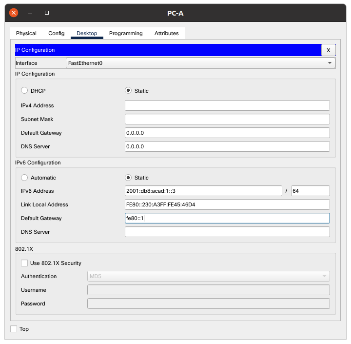
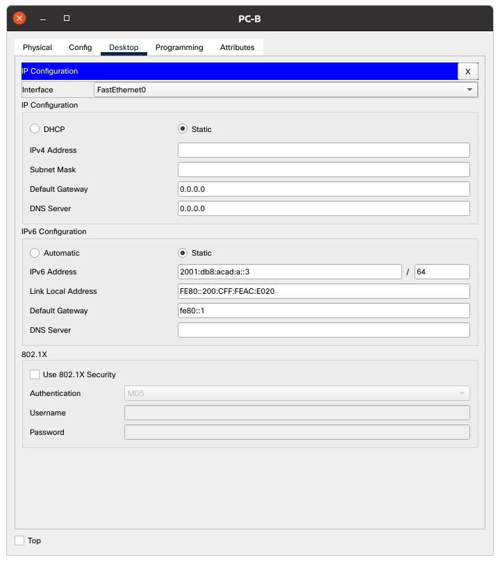

# Настройка IPv6-адресов на сетевых устройствах

## Топология


## 1. Настройка топологии и конфигурация основных параметров маршрутизатора и коммутатора

### 1.1 Настройте маршрутизатор.

Назначьте имя хоста и настройте основные параметры устройства.

```shell
Router>en
Router#conf t
Enter configuration commands, one per line.  End with CNTL/Z.
Router(config)#hostname R1
R1(config)#no ip domain-lookup
R1(config)#service password-encryption
R1(config)#banner motd #
Enter TEXT message.  End with the character '#'.
Unauthorized access is strictly prohibited. #

R1(config)#
R1(config)#line console 0
R1(config-line)#password cisco
R1(config-line)#login
R1(config-line)#logging synchronous
R1(config-line)#exit
R1(config)#line vty 0 4
R1(config-line)#password cisco
R1(config-line)#login
R1(config-line)#logging synchronous
R1(config-line)#exit
R1(config)#enable secret class
R1(config)#
```

### 1.2 Настройте коммутатор.

Назначьте имя хоста и настройте основные параметры устройства.

```shell
Switch>en
Switch#conf t
Enter configuration commands, one per line.  End with CNTL/Z.
Switch(config)#hostname S1
S1(config)#no ip domain-lookup
S1(config)#service password-encryption
S1(config)#banner motd #
Enter TEXT message.  End with the character '#'.
Unauthorized access is strictly prohibited. #

S1(config)#line console 0
S1(config-line)#password cisco
S1(config-line)#login
S1(config-line)#logging synchronous
S1(config-line)#exit
S1(config)#line vty 0 4
S1(config-line)#password cisco
S1(config-line)#login
S1(config-line)#logging synchronous
S1(config-line)#exit
S1(config)#enable secret class
S1(config)#
```

## 2. Ручная настройка IPv6-адресов

### 2.1 Назначьте IPv6-адреса интерфейсам Ethernet на R1.

> 1.a Назначьте глобальные индивидуальные IPv6-адреса, указанные в таблице адресации обоим интерфейсам Ethernet на R1.

```shell
R1(config)#interface g0/0/0
R1(config-if)#ipv6 address 2001:db8:acad:a::1/64
R1(config-if)#no shutdown 

R1(config-if)#
%LINK-5-CHANGED: Interface GigabitEthernet0/0/0, changed state to up

%LINEPROTO-5-UPDOWN: Line protocol on Interface GigabitEthernet0/0/0, changed state to up

R1(config-if)#exit
R1(config-if)#
R1(config-if)#
R1(config)#interface g0/0/1
R1(config-if)#ipv6 address 2001:db8:acad:1::1/64
R1(config-if)#no shutdown 

R1(config-if)#
%LINK-5-CHANGED: Interface GigabitEthernet0/0/1, changed state to up

%LINEPROTO-5-UPDOWN: Line protocol on Interface GigabitEthernet0/0/1, changed state to up

R1(config-if)#exit
R1(config-if)#
```

> 1.b Введите команду show ipv6 interface brief, чтобы проверить, назначен ли каждому интерфейсу корректный индивидуальный IPv6-адрес.

Примечание. Отображаемый локальный адрес канала основан на адресации EUI-64, которая автоматически использует MAC-адрес интерфейса для создания 128-битного локального IPv6-адреса канала.

```shell
R1#show ipv6  interface brief 
GigabitEthernet0/0/0       [up/up]
    FE80::2D0:FFFF:FE25:C301
    2001:DB8:ACAD:A::1
GigabitEthernet0/0/1       [up/up]
    FE80::2D0:FFFF:FE25:C302
    2001:DB8:ACAD:1::1
GigabitEthernet0/0/2       [administratively down/down]
    unassigned
Vlan1                      [administratively down/down]
    unassigned
R1#
```

> 1.c Чтобы обеспечить соответствие локальных адресов канала индивидуальному адресу, вручную введите локальные адреса канала на каждом интерфейсе Ethernet на R1.

Примечание. Каждый интерфейс маршрутизатора относится к отдельной сети. Пакеты с локальным адресом канала никогда не выходят за пределы локальной сети, а значит, для обоих интерфейсов можно указывать один и тот же локальный адрес канала.

```shell
R1(config)#interface g0/0/0
R1(config-if)#ipv6 address fe80::1 link-local
R1(config-if)#exit
R1(config)#interface g0/0/1
R1(config-if)#ipv6 address fe80::1 link-local
R1(config-if)#exit
R1(config)#
```

> 1.d Используйте выбранную команду, чтобы убедиться, что локальный адрес связи изменен на fe80::1.

```shell
show ipv6 interface brief 
GigabitEthernet0/0/0       [up/up]
    FE80::1
    2001:DB8:ACAD:A::1
GigabitEthernet0/0/1       [up/up]
    FE80::1
    2001:DB8:ACAD:1::1
GigabitEthernet0/0/2       [administratively down/down]
    unassigned
Vlan1                      [administratively down/down]
    unassigned
R1#
```

> Какие группы многоадресной рассылки назначены интерфейсу G0/0?

```shell
R1#show ipv6 interface g0/0/0
GigabitEthernet0/0/0 is up, line protocol is up
  IPv6 is enabled, link-local address is FE80::1
  No Virtual link-local address(es):
  Global unicast address(es):
    2001:DB8:ACAD:A::1, subnet is 2001:DB8:ACAD:A::/64
  Joined group address(es):
    FF02::1
    FF02::1:FF00:1
  MTU is 1500 bytes
  ICMP error messages limited to one every 100 milliseconds
  ICMP redirects are enabled
  ICMP unreachables are sent
  ND DAD is enabled, number of DAD attempts: 1
  ND reachable time is 30000 milliseconds
R1#
```

### 2.2 Активируйте IPv6-маршрутизацию на R1.

> 2.a В командной строке на PC-B введите команду ipconfig, чтобы получить данные IPv6-адреса, назначенного интерфейсу ПК.

```shell
C:\>ipconfig

FastEthernet0 Connection:(default port)

   Connection-specific DNS Suffix..: 
   Link-local IPv6 Address.........: FE80::200:CFF:FEAC:E020
   IPv6 Address....................: ::
   IPv4 Address....................: 0.0.0.0
   Subnet Mask.....................: 0.0.0.0
   Default Gateway.................: ::
                                     0.0.0.0

Bluetooth Connection:

   Connection-specific DNS Suffix..: 
   Link-local IPv6 Address.........: ::
   IPv6 Address....................: ::
   IPv4 Address....................: 0.0.0.0
   Subnet Mask.....................: 0.0.0.0
   Default Gateway.................: ::
                                     0.0.0.0

C:\>
```

> Назначен ли индивидуальный IPv6-адрес сетевой интерфейсной карте (NIC) на PC-B?

Нет.

> 2.b Активируйте IPv6-маршрутизацию на R1 с помощью команды IPv6 unicast-routing.

```shell
R1(config)#ipv6 unicast-routing
R1(config)#
```

Проверяем группы R1:

```shell
R1#show ipv6  interface
GigabitEthernet0/0/0 is up, line protocol is up
  IPv6 is enabled, link-local address is FE80::1
  No Virtual link-local address(es):
  Global unicast address(es):
    2001:DB8:ACAD:A::1, subnet is 2001:DB8:ACAD:A::/64
  Joined group address(es):
    FF02::1
    FF02::2
    FF02::1:FF00:1
  MTU is 1500 bytes
  ICMP error messages limited to one every 100 milliseconds
  ICMP redirects are enabled
  ICMP unreachables are sent
  ND DAD is enabled, number of DAD attempts: 1
  ND reachable time is 30000 milliseconds
  ND advertised reachable time is 0 (unspecified)
  ND advertised retransmit interval is 0 (unspecified)
  ND router advertisements are sent every 200 seconds
  ND router advertisements live for 1800 seconds
  ND advertised default router preference is Medium
  Hosts use stateless autoconfig for addresses.
GigabitEthernet0/0/1 is up, line protocol is up
  IPv6 is enabled, link-local address is FE80::1
  No Virtual link-local address(es):
  Global unicast address(es):
    2001:DB8:ACAD:1::1, subnet is 2001:DB8:ACAD:1::/64
  Joined group address(es):
    FF02::1
    FF02::2
    FF02::1:FF00:1
  MTU is 1500 bytes
  ICMP error messages limited to one every 100 milliseconds
  ICMP redirects are enabled
  ICMP unreachables are sent
  ND DAD is enabled, number of DAD attempts: 1
  ND reachable time is 30000 milliseconds
  ND advertised reachable time is 0 (unspecified)
  ND advertised retransmit interval is 0 (unspecified)
  ND router advertisements are sent every 200 seconds
  ND router advertisements live for 1800 seconds
  ND advertised default router preference is Medium
  Hosts use stateless autoconfig for addresses.
R1#
```

> 2.c Теперь, когда R1 входит в группу многоадресной рассылки всех маршрутизаторов, еще раз введите команду ipconfig на PC-B. Проверьте данные IPv6-адреса.

```shell
C:\>ipconfig

FastEthernet0 Connection:(default port)

   Connection-specific DNS Suffix..: 
   Link-local IPv6 Address.........: FE80::200:CFF:FEAC:E020
   IPv6 Address....................: 2001:DB8:ACAD:A:200:CFF:FEAC:E020
   IPv4 Address....................: 0.0.0.0
   Subnet Mask.....................: 0.0.0.0
   Default Gateway.................: FE80::1
                                     0.0.0.0

Bluetooth Connection:

   Connection-specific DNS Suffix..: 
   Link-local IPv6 Address.........: ::
   IPv6 Address....................: ::
   IPv4 Address....................: 0.0.0.0
   Subnet Mask.....................: 0.0.0.0
   Default Gateway.................: ::
                                     0.0.0.0

C:\>
```

> Почему PC-B получил глобальный префикс маршрутизации и идентификатор подсети, которые вы настроили на R1?

Механизм динамической адресации для GUAs IPv6.

### 2.3 Назначьте IPv6-адреса интерфейсу управления (SVI) на S1.

> 3.a Назначьте адрес IPv6 для S1. Также назначьте этому интерфейсу локальный адрес канала.

```shell
S1(config)#sdm prefer dual-ipv4-and-ipv6 default
Changes to the running SDM preferences have been stored, but cannot take effect until the next reload.
Use 'show sdm prefer' to see what SDM preference is currently active.
S1(config)#end
S1#
S1#reload

S1(config)#interface vlan 1
S1(config-if)#ipv6 address 2001:db8:acad:1::b/64
S1(config-if)#ipv6 address fe80::1:1 link-local
S1(config-if)#no shutdown 

S1(config-if)#
%LINK-5-CHANGED: Interface Vlan1, changed state to up

%LINEPROTO-5-UPDOWN: Line protocol on Interface Vlan1, changed state to up

S1(config-if)#
```

> 3.b Проверьте правильность назначения IPv6-адресов интерфейсу управления с помощью команды show ipv6 interface vlan1.

```shell
S1#show ipv6 interface vlan 1
Vlan1 is up, line protocol is up
  IPv6 is enabled, link-local address is FE80::1:1
  No Virtual link-local address(es):
  Global unicast address(es):
    2001:DB8:ACAD:1::B, subnet is 2001:DB8:ACAD:1::/64
  Joined group address(es):
    FF02::1
    FF02::1:FF00:B
    FF02::1:FF01:1
  MTU is 1500 bytes
  ICMP error messages limited to one every 100 milliseconds
  ICMP redirects are enabled
  ICMP unreachables are sent
  Output features: Check hwidb
  ND DAD is enabled, number of DAD attempts: 1
  ND reachable time is 30000 milliseconds
  ND NS retransmit interval is 1000 milliseconds
S1#
```

### 2.4 Назначьте компьютерам статические IPv6-адреса.

> 4.a Откройте окно Свойства Ethernet для каждого ПК и назначьте адресацию IPv6.
> 4.b Убедитесь, что оба компьютера имеют правильную информацию адреса IPv6. Каждый компьютер должен иметь два глобальных адреса IPv6: один статический и один SLACC

PC-A:



```shell
C:\>ipconfig

FastEthernet0 Connection:(default port)

   Connection-specific DNS Suffix..: 
   Link-local IPv6 Address.........: FE80::230:A3FF:FE45:46D4
   IPv6 Address....................: 2001:DB8:ACAD:1::3
   IPv4 Address....................: 0.0.0.0
   Subnet Mask.....................: 0.0.0.0
   Default Gateway.................: FE80::1
                                     0.0.0.0

Bluetooth Connection:

   Connection-specific DNS Suffix..: 
   Link-local IPv6 Address.........: ::
   IPv6 Address....................: ::
   IPv4 Address....................: 0.0.0.0
   Subnet Mask.....................: 0.0.0.0
   Default Gateway.................: ::
                                     0.0.0.0

C:\>
```

PC-B:



```shell
C:\>ipconfig

FastEthernet0 Connection:(default port)

   Connection-specific DNS Suffix..: 
   Link-local IPv6 Address.........: FE80::200:CFF:FEAC:E020
   IPv6 Address....................: 2001:DB8:ACAD:A::3
   IPv4 Address....................: 0.0.0.0
   Subnet Mask.....................: 0.0.0.0
   Default Gateway.................: FE80::1
                                     0.0.0.0

Bluetooth Connection:

   Connection-specific DNS Suffix..: 
   Link-local IPv6 Address.........: ::
   IPv6 Address....................: ::
   IPv4 Address....................: 0.0.0.0
   Subnet Mask.....................: 0.0.0.0
   Default Gateway.................: ::
                                     0.0.0.0

C:\>
```

## 3. Проверка сквозного подключения

> С PC-A отправьте эхо-запрос на FE80::1. Это локальный адрес канала, назначенный G0/1 на R1.

```shell
C:\>ping FE80::1

Pinging FE80::1 with 32 bytes of data:

Reply from FE80::1: bytes=32 time<1ms TTL=255
Reply from FE80::1: bytes=32 time<1ms TTL=255
Reply from FE80::1: bytes=32 time<1ms TTL=255
Reply from FE80::1: bytes=32 time=1ms TTL=255

Ping statistics for FE80::1:
    Packets: Sent = 4, Received = 4, Lost = 0 (0% loss),
Approximate round trip times in milli-seconds:
    Minimum = 0ms, Maximum = 1ms, Average = 0ms

C:\>
```

> Отправьте эхо-запрос на интерфейс управления S1 с PC-A.

```shell
C:\>ping 2001:db8:acad:1::b

Pinging 2001:db8:acad:1::b with 32 bytes of data:

Reply from 2001:DB8:ACAD:1::B: bytes=32 time=2004ms TTL=255
Reply from 2001:DB8:ACAD:1::B: bytes=32 time<1ms TTL=255
Reply from 2001:DB8:ACAD:1::B: bytes=32 time<1ms TTL=255
Reply from 2001:DB8:ACAD:1::B: bytes=32 time<1ms TTL=255

Ping statistics for 2001:DB8:ACAD:1::B:
    Packets: Sent = 4, Received = 4, Lost = 0 (0% loss),
Approximate round trip times in milli-seconds:
    Minimum = 0ms, Maximum = 2004ms, Average = 501ms

C:\>
```

> Введите команду tracert на PC-A, чтобы проверить наличие сквозного подключения к PC-B.

```shell
C:\>tracert 2001:DB8:ACAD:A::3

Tracing route to 2001:DB8:ACAD:A::3 over a maximum of 30 hops: 

  1   0 ms      0 ms      0 ms      2001:DB8:ACAD:1::1
  2   0 ms      0 ms      0 ms      2001:DB8:ACAD:A::3

Trace complete.

C:\>
```

> С PC-B отправьте эхо-запрос на PC-A.

```shell
C:\>ping 2001:DB8:ACAD:1::3

Pinging 2001:DB8:ACAD:1::3 with 32 bytes of data:

Reply from 2001:DB8:ACAD:1::3: bytes=32 time<1ms TTL=127
Reply from 2001:DB8:ACAD:1::3: bytes=32 time<1ms TTL=127
Reply from 2001:DB8:ACAD:1::3: bytes=32 time<1ms TTL=127
Reply from 2001:DB8:ACAD:1::3: bytes=32 time<1ms TTL=127

Ping statistics for 2001:DB8:ACAD:1::3:
    Packets: Sent = 4, Received = 4, Lost = 0 (0% loss),
Approximate round trip times in milli-seconds:
    Minimum = 0ms, Maximum = 0ms, Average = 0ms

C:\>
```

> С PC-B отправьте эхо-запрос на локальный адрес канала G0/0 на R1.

```shell
C:\>ping FE80::1

Pinging FE80::1 with 32 bytes of data:

Reply from FE80::1: bytes=32 time<1ms TTL=255
Reply from FE80::1: bytes=32 time<1ms TTL=255
Reply from FE80::1: bytes=32 time<1ms TTL=255
Reply from FE80::1: bytes=32 time<1ms TTL=255

Ping statistics for FE80::1:
    Packets: Sent = 4, Received = 4, Lost = 0 (0% loss),
Approximate round trip times in milli-seconds:
    Minimum = 0ms, Maximum = 0ms, Average = 0ms

C:\>
```
