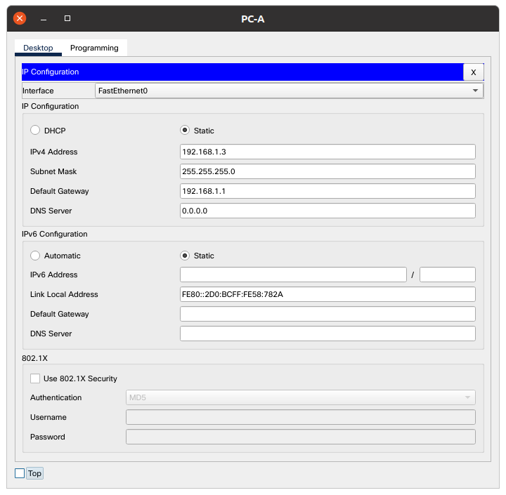
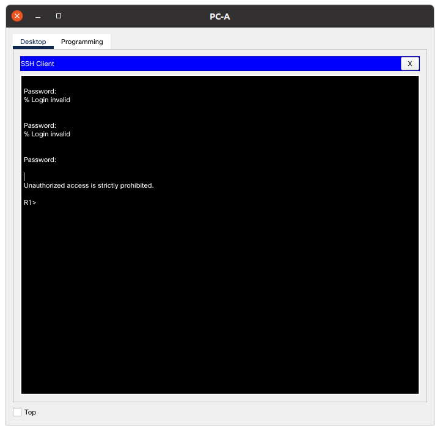
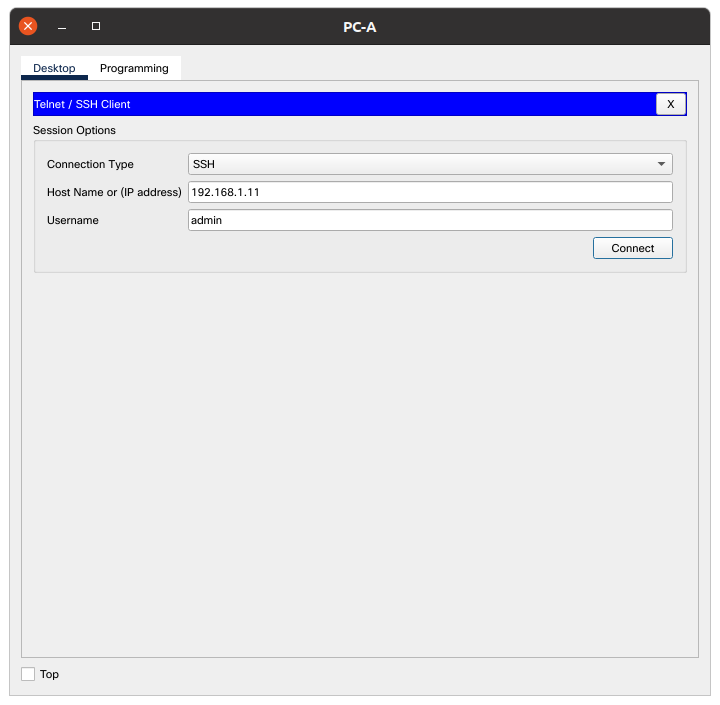
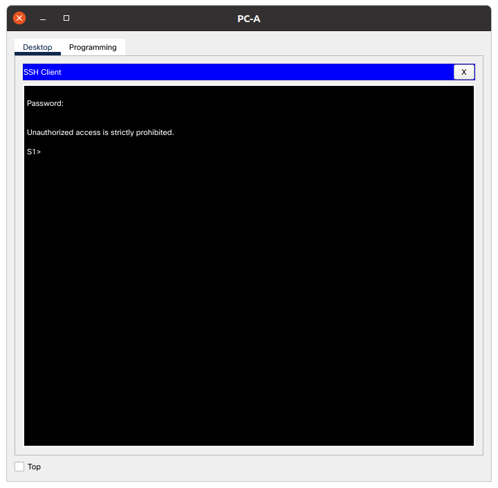

# Доступ к сетевым устройствам по протоколу SSH

## Топология


## 1. Настройка основных параметров устройств

### 1.1 Создайте сеть согласно топологии
### 1.2 Выполните инициализацию и перезагрузку маршрутизатора и коммутатора.
### 1.3 Настройте маршрутизатор.

> a. Подключитесь к маршрутизатору с помощью консоли и активируйте привилегированный режим EXEC.
> b. Войдите в режим конфигурации.
> c. Отключите поиск DNS, чтобы предотвратить попытки маршрутизатора неверно преобразовывать введенные команды таким образом, как будто они являются именами узлов.
 
```shell
Router>en
Router#conf t
Enter configuration commands, one per line.  End with CNTL/Z.
Router(config)#hostname R1
R1(config)#no ip domain-lookup 
```

> d. Назначьте class в качестве зашифрованного пароля привилегированного режима EXEC.
 
```shell
R1(config)#enable secret class
```

> e. Назначьте cisco в качестве пароля консоли и включите вход в систему по паролю.

```shell
R1(config)#line console 0
R1(config-line)#password cisco
R1(config-line)#login
R1(config-line)#logging synchronous 
R1(config-line)#exit
```

> f. Назначьте cisco в качестве пароля VTY и включите вход в систему по паролю.

```shell
R1(config)#line vty 0 4
R1(config-line)#password cisco
R1(config-line)#login
R1(config-line)#logging synchronous 
R1(config-line)#exit
```

> g. Зашифруйте открытые пароли.

```shell
R1(config)#service password-encryption
```

> h. Создайте баннер, который предупреждает о запрете несанкционированного доступа.

```shell
R1(config)#banner motd #
Enter TEXT message.  End with the character '#'.
Unauthorized access is strictly prohibited. #

R1(config)#
```

> i. Настройте и активируйте на маршрутизаторе интерфейс G0/0/1, используя информацию, приведенную в таблице адресации.
 
```shell
R1(config)#interface gigabitEthernet 0/0/1
R1(config-if)#ip address 192.168.1.1 255.255.255.0
R1(config-if)#no shutdown

R1(config-if)#
%LINK-5-CHANGED: Interface GigabitEthernet0/0/1, changed state to up

%LINEPROTO-5-UPDOWN: Line protocol on Interface GigabitEthernet0/0/1, changed state to up

R1(config-if)#exit
```

> j. Сохраните текущую конфигурацию в файл загрузочной конфигурации.
 
```shell
R1#copy running-config startup-config 
Destination filename [startup-config]? 
Building configuration...
[OK]
R1#
```

### 1.4 Настройте компьютер PC-A.

> a. Настройте для PC-A IP-адрес и маску подсети.
> b. Настройте для PC-A шлюз по умолчанию.
 


### 1.5 Проверьте подключение к сети.

> Пошлите с PC-A команду Ping на маршрутизатор R1. Если эхо-запрос с помощью команды ping не проходит, 
найдите и устраните неполадки подключения.

```shell
C:\>ping 192.168.1.1

Pinging 192.168.1.1 with 32 bytes of data:

Reply from 192.168.1.1: bytes=32 time<1ms TTL=255
Reply from 192.168.1.1: bytes=32 time<1ms TTL=255
Reply from 192.168.1.1: bytes=32 time<1ms TTL=255
Reply from 192.168.1.1: bytes=32 time<1ms TTL=255

Ping statistics for 192.168.1.1:
    Packets: Sent = 4, Received = 4, Lost = 0 (0% loss),
Approximate round trip times in milli-seconds:
    Minimum = 0ms, Maximum = 0ms, Average = 0ms

C:\>
```

## 2. Настройка маршрутизатора для доступа по протоколу SSH

### 2.1 Настройте аутентификацию устройств.

При генерации ключа шифрования в качестве его части используются имя устройства и домен. Поэтому эти имена необходимо указать перед вводом команды **crypto key**.

> a. Задайте имя устройства.
> b. Задайте домен для устройства.

```shell
Router(config)#hostname R1
R1(config)#ip domain name world
```

### 2.2 Создайте ключ шифрования с указанием его длины.

```shell
R1(config)#crypto key generate rsa general-keys modulus 1024
The name for the keys will be: R1.world

% The key modulus size is 1024 bits
% Generating 1024 bit RSA keys, keys will be non-exportable...[OK]
*Mar 1 0:54:14.571: %SSH-5-ENABLED: SSH 1.99 has been enabled
```

### 2.3 Создайте имя пользователя в локальной базе учетных записей.

Настройте имя пользователя, используя **admin** в качестве имени пользователя и **Adm1nP @55** в качестве пароля.

```shell
R1(config)#username admin secret Adm1nP @55
```

### 2.4 Активируйте протокол SSH на линиях VTY.

> a. Активируйте протоколы Telnet и SSH на входящих линиях VTY с помощью команды transport input.
> b. Измените способ входа в систему таким образом, чтобы использовалась проверка пользователей по локальной базе учетных записей.

```shell
R1(config)#ip ssh version 2
R1(config)#line vty 0 4
R1(config-line)#transport input ssh
R1(config-line)#login local
R1(config-line)#exit
R1(config)#
```

### 2.5 Сохраните текущую конфигурацию в файл загрузочной конфигурации.

```shell
R1#copy running-config startup-config 
Destination filename [startup-config]? 
Building configuration...
[OK]
R1#
```

### 2.6 Установите соединение с маршрутизатором по протоколу SSH.

> a. Запустите Tera Term с PC-A.
> b. Установите SSH-подключение к R1. Use the username admin and password Adm1nP @55. 
У вас должно получиться установить SSH-подключение к R1.




## 3. Настройка коммутатора для доступа по протоколу SSH

### 3.1 Настройте основные параметры коммутатора.

> 1.a Подключитесь к коммутатору с помощью консольного подключения и активируйте привилегированный режим EXEC.
> 1.b Войдите в режим конфигурации.
> 1.c Отключите поиск DNS, чтобы предотвратить попытки маршрутизатора неверно преобразовывать введенные команды таким образом, как будто они являются именами узлов.

```shell
Switch>en
Switch#conf t
Enter configuration commands, one per line.  End with CNTL/Z.
Switch(config)#host S1
S1(config)#no ip domain-lookup 
S1(config)#
```

> 1.d Назначьте class в качестве зашифрованного пароля привилегированного режима EXEC.

```shell
S1(config)#enable secret class
```

> 1.e Назначьте cisco в качестве пароля консоли и включите вход в систему по паролю.

```shell
S1(config)#line console 0
S1(config-line)#password cisco
S1(config-line)#login
S1(config-line)#logging synchronous 
S1(config-line)#exit
S1(config)#
```

> 1.f Назначьте cisco в качестве пароля VTY и включите вход в систему по паролю.

```shell
S1(config)#line vty  0 4
S1(config-line)#password cisco
S1(config-line)#login
S1(config-line)#logging synchronous 
S1(config-line)#exit
S1(config)#
```

> 1.g Зашифруйте открытые пароли.

```shell
S1(config)#service password-encryption
```

> 1.h Создайте баннер, который предупреждает о запрете несанкционированного доступа.

```shell
S1(config)#banner motd #
Enter TEXT message.  End with the character '#'.
Unauthorized access is strictly prohibited. #

S1(config)#
```

> 1.i Настройте и активируйте на коммутаторе интерфейс VLAN 1, используя информацию, приведенную в таблице адресации.

```shell
S1(config)#interface VLan 1
S1(config-if)#ip address 192.168.1.11 255.255.255.0
S1(config-if)#no shutdown

S1(config-if)#
%LINK-5-CHANGED: Interface Vlan1, changed state to up

%LINEPROTO-5-UPDOWN: Line protocol on Interface Vlan1, changed state to up

S1(config-if)#exit
S1(config)#ip default-gateway 192.168.1.1
S1(config)#
```

> 1.j Сохраните текущую конфигурацию в файл загрузочной конфигурации.

```shell
S1#copy running-config startup-config 
Destination filename [startup-config]? 
Building configuration...
[OK]
S1#
```

### 3.2 Настройте коммутатор для соединения по протоколу SSH.

> 2.a Настройте имя устройства, как указано в таблице адресации.
> 2.b Задайте домен для устройства.

```shell
Router(config)#hostname R1
S1(config)#ip domain name island
S1(config)#
```

> 2.c Создайте ключ шифрования с указанием его длины.

```shell
S1(config)#crypto key generate rsa general-keys modulus 1024
The name for the keys will be: S1.island

% The key modulus size is 1024 bits
% Generating 1024 bit RSA keys, keys will be non-exportable...[OK]
*Mar 1 0:29:3.120: %SSH-5-ENABLED: SSH 1.99 has been enabled
S1(config)#
```

> 2.d Создайте имя пользователя в локальной базе учетных записей.

```shell
S1(config)#username admin secret Adm1nP @55
```

> 2.e Активируйте протоколы Telnet и SSH на линиях VTY.
> 2.f Измените способ входа в систему таким образом, чтобы использовалась проверка пользователей по локальной базе учетных записей.

```shell
R1(config)#ip ssh version 2
S1(config)#line vty 0 4
S1(config-line)#transport input telnet
S1(config-line)#transport input ssh
S1(config-line)#login local
S1(config-line)#exit
S1(config)#
```

### 3.3 Установите соединение с коммутатором по протоколу SSH.

Запустите программу Tera Term на PC-A, затем установите подключение по протоколу SSH к интерфейсу SVI коммутатора S1.

> Удалось ли вам установить SSH-соединение с коммутатором?





## 4. Настройка протокола SSH с использованием интерфейса командной строки (CLI) коммутатора

Клиент SSH встроен в операционную систему Cisco IOS и может запускаться из интерфейса командной строки. 
В части 4 вам предстоит установить соединение с маршрутизатором по протоколу SSH, используя интерфейс командной строки коммутатора.

### 4.1 Посмотрите доступные параметры для клиента SSH в Cisco IOS.

```shell
S1#ssh ?
  -l  Log in using this user name
  -v  Specify SSH Protocol Version
```

### 4.2 Установите с коммутатора S1 соединение с маршрутизатором R1 по протоколу SSH.

> 2.a Чтобы подключиться к маршрутизатору R1 по протоколу SSH, введите команду –l admin. 
Это позволит вам войти в систему под именем admin. При появлении приглашения введите в качестве пароля Adm1nP@55

```shell
S1#ssh -l admin 192.168.1.1

Password: 


Unauthorized access is strictly prohibited. 

R1>
```

> 2.b Чтобы вернуться к коммутатору S1, не закрывая сеанс SSH с маршрутизатором R1, 
нажмите комбинацию клавиш Ctrl+Shift+6. Отпустите клавиши Ctrl+Shift+6 и нажмите x. 
Отображается приглашение привилегированного режима EXEC коммутатора.

```shell
R1>
S1#
```

> 2.c Чтобы вернуться к сеансу SSH на R1, нажмите клавишу Enter в пустой строке интерфейса командной строки. 
Чтобы увидеть окно командной строки маршрутизатора, нажмите клавишу Enter еще раз.

```shell
S1#
[Resuming connection 1 to 192.168.1.1 ... ]

R1>
```

> 2.d Чтобы завершить сеанс SSH на маршрутизаторе R1, введите в командной строке маршрутизатора команду exit.

```shell
R1>exit

[Connection to 192.168.1.1 closed by foreign host]
S1#
```

> Какие версии протокола SSH поддерживаются при использовании интерфейса командной строки?

```shell
S1#ssh -v ?
  1  Protocol Version 1
  2  Protocol Version 2
S1#ssh -v 
```
