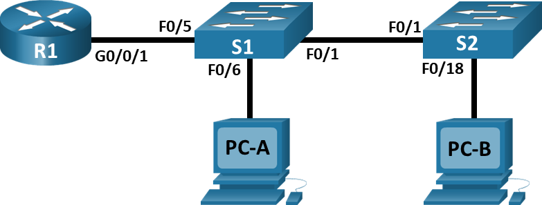

# Внедрение маршрутизации между виртуальными локальными сетями

## Топология



## 1. Создание сети и настройка основных параметров устройства

### 1.1 Создайте сеть согласно топологии


### 1.2 Настройте базовые параметры для маршрутизатора.


> a. Подключитесь к маршрутизатору с помощью консоли и активируйте привилегированный режим EXEC.
> b. Войдите в режим конфигурации.
> c. Назначьте маршрутизатору имя устройства.
> d. Отключите поиск DNS, чтобы предотвратить попытки маршрутизатора неверно преобразовывать введенные команды таким образом, как будто они являются именами узлов.
> e. Назначьте class в качестве зашифрованного пароля привилегированного режима EXEC.
> f. Назначьте cisco в качестве пароля консоли и включите вход в систему по паролю.
> g. Установите cisco в качестве пароля виртуального терминала и активируйте вход.
> h. Зашифруйте открытые пароли.
> i. Создайте баннер с предупреждением о запрете несанкционированного доступа к устройству.
> j. Сохраните текущую конфигурацию в файл загрузочной конфигурации.
> k. Настройте на маршрутизаторе время.

```shell
Router>en
Router#conf t
Enter configuration commands, one per line.  End with CNTL/Z.
Router(config)#hostname R1
R1(config)#no ip domain-lookup 
R1(config)#enable secret class
R1(config)#line console 0
R1(config-line)#password cisco
R1(config-line)#login
R1(config-line)#logging synchronous 
R1(config-line)#exit
R1(config)#line vty 0 4
R1(config-line)#pass
R1(config-line)#password cisco login
R1(config-line)#logging synchronous 
R1(config-line)#exit
R1(config)#service password-encryption 
R1(config)#banner motd #Unauthorized access is strictly prohibited.#
R1(config)#exit
R1#
%SYS-5-CONFIG_I: Configured from console by console

R1#show clock detail 
*0:13:33.258 UTC Mon Mar 1 1993
Time source is hardware calendar
R1#clock set 14:34:00 Sep 16 2021 
R1#conf t
Enter configuration commands, one per line.  End with CNTL/Z.
R1(config)#clock timezone MSK 7
R1(config)#exit
R1#
%SYS-5-CONFIG_I: Configured from console by console

R1#show clock detail 
21:34:43.659 MSK Thu Sep 16 2021
Time source is user configuration
R1#copy running-config startup-config 
Destination filename [startup-config]? 
Building configuration...
[OK]
R1#
```

### 1.3 Настройте базовые параметры каждого коммутатора.

> a. Присвойте коммутатору имя устройства.
> b. Отключите поиск DNS, чтобы предотвратить попытки маршрутизатора неверно преобразовывать введенные команды таким образом, как будто они являются именами узлов.
> c. Назначьте class в качестве зашифрованного пароля привилегированного режима EXEC.
> d. Назначьте cisco в качестве пароля консоли и включите вход в систему по паролю.
> e. Установите cisco в качестве пароля виртуального терминала и активируйте вход.
> f. Зашифруйте открытые пароли.
> g. Создайте баннер с предупреждением о запрете несанкционированного доступа к устройству.
> h. Настройте на коммутаторах время.
> i. Сохранение текущей конфигурации в качестве начальной.

S1:

```shell
Switch>en
Switch#conf t
Enter configuration commands, one per line.  End with CNTL/Z.
Switch(config)#h S1
S1(config)#no ip domain lookup
S1(config)#enable secret class
S1(config)#line cons
S1(config)#line console 0
S1(config-line)#pass
S1(config-line)#password cisco
S1(config-line)#login
S1(config-line)#logging syn
S1(config-line)#logging synchronous 
S1(config-line)#exit
S1(config)#line vty 0 4
S1(config-line)#passw
S1(config-line)#password cisco
S1(config-line)#login
S1(config-line)#loggin
S1(config-line)#logging syn
S1(config-line)#logging synchronous 
S1(config-line)#exit
S1(config)#serv
S1(config)#service pass
S1(config)#service password-encryption 
S1(config)#ban
S1(config)#banner mot
S1(config)#banner motd #Unauthorized access is strictly prohibited.#
S1(config)#exit
S1#
%SYS-5-CONFIG_I: Configured from console by console

S1#show clock detail 
*0:6:15.663 UTC Mon Mar 1 1993
Time source is hardware calendar
S1#clock set 08:41:00 Sep 17 2021
S1#show clock detail 
11:41:4.572 UTC Fri Sep 17 2021
Time source is user configuration
S1#conf t 
Enter configuration commands, one per line.  End with CNTL/Z.
S1(config)#clock timezone UTC 10
S1(config)#exit
S1#
%SYS-5-CONFIG_I: Configured from console by console

S1#show clock detail
18:41:36.303 UTC Fri Sep 17 2021
Time source is user configuration
S1#copy running-config startup-config 
Destination filename [startup-config]? 
Building configuration...
[OK]
S1#
```

S2:

```shell
Switch>en
Switch#conf t
Enter configuration commands, one per line.  End with CNTL/Z.
Switch(config)#h S2
S2(config)#no ip domain lookup
S2(config)#enable secret class
S2(config)#line console 0
S2(config-line)#password cisco
S2(config-line)#login
S2(config-line)#logging synchronous 
S2(config-line)#exit
S2(config)#line vty 0 4
S2(config-line)#password cisco
S2(config-line)#login
S2(config-line)#logging synchronous 
S2(config-line)#exit
S2(config)#service password-encryption 
S2(config)#banner motd #Unauthorized access is strictly prohibited.#
S2(config)#exit
S2#
%SYS-5-CONFIG_I: Configured from console by console

S2#show clock detail
*0:15:36.915 UTC Mon Mar 1 1993
Time source is hardware calendar
S2#clock set 08:50:00 Sep 17 2021
S2#show clock detail
8:50:1.920 UTC Fri Sep 17 2021
Time source is user configuration
S2#conf t
Enter configuration commands, one per line.  End with CNTL/Z.
S2(config)#clock timezone UTC 10
S2(config)#exit
S2#
%SYS-5-CONFIG_I: Configured from console by console

S2#show clock detail
18:50:28.492 UTC Fri Sep 17 2021
Time source is user configuration
S2#copy running-config startup-config 
Destination filename [startup-config]? 
Building configuration...
[OK]
S2#
```

### 1.4 Настройте узлы ПК.

PC-1


PC-2


## 2. Создание сетей VLAN и назначение портов коммутатора

### 2.1 Создайте сети VLAN на коммутаторах.

> a. Создайте и назовите необходимые VLAN на каждом коммутаторе из таблицы выше.

S1:

```shell
S1>en
Password: 
S1#conf t
Enter configuration commands, one per line.  End with CNTL/Z.
S1(config)#vlan 10
S1(config-vlan)#name Management
VLAN #99 and #10 have an identical name: Management
S1(config)#vlan 10
S1(config-vlan)#name Management
S1(config-vlan)#vlan 20
S1(config-vlan)#name Sales
S1(config-vlan)#vlan 30
S1(config-vlan)#name Operations
S1(config-vlan)#vlan 999
S1(config-vlan)#name Parking_Lot
S1(config-vlan)#exit
S1(config)#do show vlan brief

VLAN Name                             Status    Ports
---- -------------------------------- --------- -------------------------------
1    default                          active    Fa0/1, Fa0/2, Fa0/3, Fa0/4
                                                Fa0/5, Fa0/6, Fa0/7, Fa0/8
                                                Fa0/9, Fa0/10, Fa0/11, Fa0/12
                                                Fa0/13, Fa0/14, Fa0/15, Fa0/16
                                                Fa0/17, Fa0/18, Fa0/19, Fa0/20
                                                Fa0/21, Fa0/22, Fa0/23, Fa0/24
                                                Gig0/1, Gig0/2
10   Management                       active    
20   Sales                            active    
30   Operations                       active    
999  Parking_Lot                      active    
1002 fddi-default                     active    
1003 token-ring-default               active    
1004 fddinet-default                  active    
1005 trnet-default                    active    
S1(config)#
```

S2:

```shell
S2>en
Password: 
S2#conf t
Enter configuration commands, one per line.  End with CNTL/Z.
S2(config)#vlan 10
S2(config-vlan)#name Management
S2(config-vlan)#vlan 20
S2(config-vlan)#name Sales
S2(config-vlan)#vlan 30
S2(config-vlan)#name Operations
S2(config-vlan)#vlan 999
S2(config-vlan)#name Parking_Lot
S2(config-vlan)#exit
S2(config)#do show vlan brief

VLAN Name                             Status    Ports
---- -------------------------------- --------- -------------------------------
1    default                          active    Fa0/1, Fa0/2, Fa0/3, Fa0/4
                                                Fa0/5, Fa0/6, Fa0/7, Fa0/8
                                                Fa0/9, Fa0/10, Fa0/11, Fa0/12
                                                Fa0/13, Fa0/14, Fa0/15, Fa0/16
                                                Fa0/17, Fa0/18, Fa0/19, Fa0/20
                                                Fa0/21, Fa0/22, Fa0/23, Fa0/24
                                                Gig0/1, Gig0/2
10   Management                       active    
20   Sales                            active    
30   Operations                       active    
999  Parking_Lot                      active    
1002 fddi-default                     active    
1003 token-ring-default               active    
1004 fddinet-default                  active    
1005 trnet-default                    active    
S2(config)#
```

> b. Настройте интерфейс управления и шлюз по умолчанию на каждом коммутаторе, используя информацию об IP-адресе в таблице адресации.

S1:

```shell
S1(config)#interface vlan 10
S1(config-if)#
%LINK-5-CHANGED: Interface Vlan10, changed state to up

%LINEPROTO-5-UPDOWN: Line protocol on Interface Vlan10, changed state to up

S1(config-if)#ip address 192.168.10.11 255.255.255.0
S1(config-if)#no shutdown
S1(config-if)#exit
S1(config)#ip default-gateway 192.168.10.1
S1(config)#
S1(config)#do show ip interface vlan 10
Vlan10 is up, line protocol is up
  Internet address is 192.168.10.11/24
  Broadcast address is 255.255.255.255 
  Address determined by setup command 
  MTU is 1500 bytes 
  Helper address is not set
  Directed broadcast forwarding is disabled 
  Outgoing access list is not set 
  Inbound  access list is not set 
  Proxy ARP is enabled 
  Local Proxy ARP is disabled 
  Security level is default 
  Split horizon is enabled 
  ICMP redirects are always sent 
  ICMP unreachables are always sent 
  ICMP mask replies are never sent 
  IP fast switching is disabled 
  IP fast switching on the same interface is disabled 
  IP Null turbo vector 
  IP multicast fast switching is disabled 
  IP multicast distributed fast switching is disabled 
  IP route-cache flags are None 
  Router Discovery is disabled 
  IP output packet accounting is disabled 
  IP access violation accounting is disabled 
  TCP/IP header compression is disabled 
  RTP/IP header compression is disabled 
  Probe proxy name replies are disabled 
  Policy routing is disabled 
  Network address translation is disable 
  WCCP Redirect outbound is disabled 
  WCCP Redirect inbound is disabled 
  WCCP Redirect exclude is disabled 
  BGP Policy Mapping is disabled 

S1(config)#
```

S2:

```shell
S1(config)#interface vlan 10
S2(config-if)#ip address 192.168.10.12 255.255.255.0
S2(config-if)#no shutdown
S2(config-if)#exit
S2(config)#ip default-gateway 192.168.10.1
S2(config)#
S2(config)#do show ip interface vlan 10
Vlan10 is up, line protocol is up
  Internet address is 192.168.10.12/24
  Broadcast address is 255.255.255.255 
  Address determined by setup command 
  MTU is 1500 bytes 
  Helper address is not set
  Directed broadcast forwarding is disabled 
  Outgoing access list is not set 
  Inbound  access list is not set 
  Proxy ARP is enabled 
  Local Proxy ARP is disabled 
  Security level is default 
  Split horizon is enabled 
  ICMP redirects are always sent 
  ICMP unreachables are always sent 
  ICMP mask replies are never sent 
  IP fast switching is disabled 
  IP fast switching on the same interface is disabled 
  IP Null turbo vector 
  IP multicast fast switching is disabled 
  IP multicast distributed fast switching is disabled 
  IP route-cache flags are None 
  Router Discovery is disabled 
  IP output packet accounting is disabled 
  IP access violation accounting is disabled 
  TCP/IP header compression is disabled 
  RTP/IP header compression is disabled 
  Probe proxy name replies are disabled 
  Policy routing is disabled 
  Network address translation is disable 
  WCCP Redirect outbound is disabled 
  WCCP Redirect inbound is disabled 
  WCCP Redirect exclude is disabled 
  BGP Policy Mapping is disabled 

S2(config)#
```

> c. Назначьте все неиспользуемые порты коммутатора VLAN Parking_Lot, настройте их для статического режима доступа и административно деактивируйте их.

Примечание. Команда interface range полезна для выполнения этой задачи с минимальным количеством команд.

S1:

```shell
S1(config)#interface range fastEthernet 0/2-4, fastEthernet 0/7-24, gigabitEthernet 0/1-2
S1(config-if-range)#switchport mode access
S1(config-if-range)#switchport access vlan 999
S1(config-if-range)#shutdown
S1(config-if-range)#exit
S1(config)#
```

S2:

```shell
S2(config)#interface range fastEthernet 0/2-17, fastEthernet 0/19-24, gigabitEthernet 0/1-2
S2(config-if-range)#switchport mode access 
S2(config-if-range)#switchport access vlan 999
S2(config-if-range)#shutdown
S2(config-if-range)#exit
S2(config)#
```

### 2.2 Назначьте сети VLAN соответствующим интерфейсам коммутатора.

> a. Назначьте используемые порты соответствующей VLAN (указанной в таблице VLAN выше) и настройте их для режима статического доступа.
> b. Убедитесь, что VLAN назначены на правильные интерфейсы.

S1:

```shell
S1(config)#interface f0/6
S1(config-if)#switchport mode access 
S1(config-if)#switchport access vlan 20
S1(config-if)#no shutdown
S1(config-if)#exit
S1(config)#
S1(config)#do show vlan brief

VLAN Name                             Status    Ports
---- -------------------------------- --------- -------------------------------
1    default                          active    
10   Management                       active    
20   Sales                            active    Fa0/6
30   Operations                       active    
999  Parking_Lot                      active    Fa0/2, Fa0/3, Fa0/4, Fa0/7
                                                Fa0/8, Fa0/9, Fa0/10, Fa0/11
                                                Fa0/12, Fa0/13, Fa0/14, Fa0/15
                                                Fa0/16, Fa0/17, Fa0/18, Fa0/19
                                                Fa0/20, Fa0/21, Fa0/22, Fa0/23
                                                Fa0/24, Gig0/1, Gig0/2
1002 fddi-default                     active    
1003 token-ring-default               active    
1004 fddinet-default                  active    
1005 trnet-default                    active    
S1(config)#
```

S2:

```shell
S2(config)#interface fastEthernet 0/18
S2(config-if)#switchport mode access 
S2(config-if)#switchport access vlan 10
S2(config-if)#no shutdown 

S2(config-if)#
%LINK-5-CHANGED: Interface FastEthernet0/18, changed state to up

%LINEPROTO-5-UPDOWN: Line protocol on Interface FastEthernet0/18, changed state to up

S2(config-if)#exit
S2(config)#
S2(config)#do show vlan brief

VLAN Name                             Status    Ports
---- -------------------------------- --------- -------------------------------
1    default                          active    
10   Management                       active    
20   Sales                            active    
30   Operations                       active    Fa0/18
999  Parking_Lot                      active    Fa0/2, Fa0/3, Fa0/4, Fa0/5
                                                Fa0/6, Fa0/7, Fa0/8, Fa0/9
                                                Fa0/10, Fa0/11, Fa0/12, Fa0/13
                                                Fa0/14, Fa0/15, Fa0/16, Fa0/17
                                                Fa0/19, Fa0/20, Fa0/21, Fa0/22
                                                Fa0/23, Fa0/24, Gig0/1, Gig0/2
1002 fddi-default                     active    
1003 token-ring-default               active    
1004 fddinet-default                  active    
1005 trnet-default                    active    
S2(config)#
```

## 3. Настройка транка 802.1Q между коммутаторами.

### 3.1 Вручную настройте магистральный интерфейс F0/1 на коммутаторах S1 и S2.

> a. Настройка статического транкинга на интерфейсе F0/1 для обоих коммутаторов.
> b. Установите native VLAN 1000 на обоих коммутаторах.
> c. Укажите, что VLAN 10, 20, 30 и 1000 могут проходить по транку.
> d. Проверьте транки, native VLAN и разрешенные VLAN через транк.

S1:

```shell
S1(config)#interface f0/1
S1(config-if)#switchport mode trunk 

S1(config-if)#
%LINEPROTO-5-UPDOWN: Line protocol on Interface FastEthernet0/1, changed state to down

%LINEPROTO-5-UPDOWN: Line protocol on Interface FastEthernet0/1, changed state to up

%LINEPROTO-5-UPDOWN: Line protocol on Interface Vlan999, changed state to up

S1(config-if)#switchport trunk native vlan 1000
S1(config-if)#switchport trunk allowed vlan 10,20,30,1000
S1(config-if)#no shutdown 
S1(config-if)#
S1(config-if)#do show interface trunk
Port        Mode         Encapsulation  Status        Native vlan
Fa0/1       on           802.1q         trunking      1000

Port        Vlans allowed on trunk
Fa0/1       10,20,30,1000

Port        Vlans allowed and active in management domain
Fa0/1       10,20,30

Port        Vlans in spanning tree forwarding state and not pruned
Fa0/1       none

S1(config-if)#
%CDP-4-NATIVE_VLAN_MISMATCH: Native VLAN mismatch discovered on FastEthernet0/1 (1000), with S2 FastEthernet0/1 (1).

S1(config-if)#
```

S2:

```shell
S2(config)#interface f0/1
S2(config-if)#switchport mode trunk
%CDP-4-NATIVE_VLAN_MISMATCH: Native VLAN mismatch discovered on FastEthernet0/1 (1), with S1 FastEthernet0/1 (1000).
S2(config-if)#switchport trunk native vlan 1000
S2(config-if)#switchport trunk allowed vlan 10,20,30,1000
S2(config-if)#no shutdown
S2(config-if)#
S2(config-if)#do show interface trunk
Port        Mode         Encapsulation  Status        Native vlan
Fa0/1       on           802.1q         trunking      1000

Port        Vlans allowed on trunk
Fa0/1       10,20,30,1000

Port        Vlans allowed and active in management domain
Fa0/1       10,20,30

Port        Vlans in spanning tree forwarding state and not pruned
Fa0/1       10,20,30

S2(config-if)#
```

### 3.2 Вручную настройте магистральный интерфейс F0/5 на коммутаторе S1.

> a. Настройте интерфейс S1 F0/5 с теми же параметрами транка, что и F0/1. Это транк до маршрутизатора.

```shell
S1(config)#interface fastEthernet 0/5
S1(config-if)#switchport mode trunk 
S1(config-if)#switchport trunk native vlan 1000
S1(config-if)#switchport trunk allowed vlan 10,20,30,1000
S1(config-if)#no shutdown 
S1(config-if)#exit
```

> b. Сохраните текущую конфигурацию в файл загрузочной конфигурации.

```shell
S1#copy running-config startup-config 
Destination filename [startup-config]? 
Building configuration...
[OK]
S1#

=======================================

S2#copy running-config startup-config 
Destination filename [startup-config]? 
Building configuration...
[OK]
S2#
```

> c. Проверка транкинга. Что произойдет, если G0/0/1 на R1 будет отключен? 

F0/5 (S1) не будет отображаться по команде:

```shell
S1#show interfaces trunk 
Port        Mode         Encapsulation  Status        Native vlan
Fa0/1       on           802.1q         trunking      1000

Port        Vlans allowed on trunk
Fa0/1       10,20,30,1000

Port        Vlans allowed and active in management domain
Fa0/1       10,20,30

Port        Vlans in spanning tree forwarding state and not pruned
Fa0/1       10,20,30

S1#
```

## 4. Настройка маршрутизации между сетями VLAN

### 4.1 Настройте маршрутизатор.

> a. При необходимости активируйте интерфейс G0/0/1 на маршрутизаторе.

```shell
R1(config)#interface GigabitEthernet 0/0/1
R1(config-if)#description Trunk link to S1
R1(config-if)#no shutdown

R1(config-if)#
%LINK-5-CHANGED: Interface GigabitEthernet0/0/1, changed state to up

%LINEPROTO-5-UPDOWN: Line protocol on Interface GigabitEthernet0/0/1, changed state to up

R1(config-if)#end
R1#
%SYS-5-CONFIG_I: Configured from console by console

R1#
```

> b. Настройте подинтерфейсы для каждой VLAN, как указано в таблице IP-адресации. Все подинтерфейсы используют инкапсуляцию 802.1Q. Убедитесь, что подинтерфейсу для native VLAN не назначен IP-адрес. Включите описание для каждого подинтерфейса.

```shell
R1(config)#interface g0/0/1.10
R1(config-subif)#description Default Gateway for VLAN 10
R1(config-subif)#encapsulation dot1Q 10
R1(config-subif)#ip add 192.168.10.1 255.255.255.0
R1(config-subif)#exit
R1(config)#interface g0/0/1.20
R1(config-subif)#description Default Gateway for VLAN 20
R1(config-subif)#encapsulation dot1Q 20
R1(config-subif)#ip add 192.168.20.1 255.255.255.0
R1(config-subif)#exit
R1(config)#interface g0/0/1.30
R1(config-subif)#description Default Gateway for VLAN 30
R1(config-subif)#encapsulation dot1Q 30
R1(config-subif)#ip add 192.168.30.1 255.255.255.0
R1(config-subif)#exit
```

> c. Убедитесь, что вспомогательные интерфейсы работают

```shell
R1(config)#do show ip interface brief
Interface              IP-Address      OK? Method Status                Protocol 
GigabitEthernet0/0/0   unassigned      YES unset  administratively down down 
GigabitEthernet0/0/1   unassigned      YES unset  up                    up 
GigabitEthernet0/0/1.10192.168.10.1    YES manual up                    up 
GigabitEthernet0/0/1.20192.168.20.1    YES manual up                    up 
GigabitEthernet0/0/1.30192.168.30.1    YES manual up                    up 
GigabitEthernet0/0/2   unassigned      YES unset  administratively down down 
Vlan1                  unassigned      YES unset  administratively down down
```

## 5. Проверка, что маршрутизация между VLAN работает

### 5.1 Выполните следующие тесты с PC-A. Все должно быть успешно.

> a. Отправьте эхо-запрос с PC-A на шлюз по умолчанию.

```shell
C:\>ping  192.168.20.1

Pinging 192.168.20.1 with 32 bytes of data:

Reply from 192.168.20.1: bytes=32 time<1ms TTL=255
Reply from 192.168.20.1: bytes=32 time<1ms TTL=255
Reply from 192.168.20.1: bytes=32 time<1ms TTL=255
Reply from 192.168.20.1: bytes=32 time<1ms TTL=255

Ping statistics for 192.168.20.1:
    Packets: Sent = 4, Received = 4, Lost = 0 (0% loss),
Approximate round trip times in milli-seconds:
    Minimum = 0ms, Maximum = 0ms, Average = 0ms
```

> b. Отправьте эхо-запрос с PC-A на PC-B.

```shell
C:\>ping 192.168.30.3

Pinging 192.168.30.3 with 32 bytes of data:

Reply from 192.168.30.3: bytes=32 time<1ms TTL=127
Reply from 192.168.30.3: bytes=32 time<1ms TTL=127
Reply from 192.168.30.3: bytes=32 time<1ms TTL=127
Reply from 192.168.30.3: bytes=32 time<1ms TTL=127

Ping statistics for 192.168.30.3:
    Packets: Sent = 4, Received = 4, Lost = 0 (0% loss),
Approximate round trip times in milli-seconds:
    Minimum = 0ms, Maximum = 0ms, Average = 0ms
```

> c. Отправьте команду ping с компьютера PC-A на коммутатор S2.

```shell
C:\>ping 192.168.10.12

Pinging 192.168.10.12 with 32 bytes of data:

Request timed out.
Request timed out.
Reply from 192.168.10.12: bytes=32 time<1ms TTL=254
Reply from 192.168.10.12: bytes=32 time<1ms TTL=254

Ping statistics for 192.168.10.12:
    Packets: Sent = 4, Received = 2, Lost = 2 (50% loss),
Approximate round trip times in milli-seconds:
    Minimum = 0ms, Maximum = 0ms, Average = 0ms

C:\>ping 192.168.10.12

Pinging 192.168.10.12 with 32 bytes of data:

Reply from 192.168.10.12: bytes=32 time<1ms TTL=254
Reply from 192.168.10.12: bytes=32 time<1ms TTL=254
Reply from 192.168.10.12: bytes=32 time<1ms TTL=254
Reply from 192.168.10.12: bytes=32 time<1ms TTL=254

Ping statistics for 192.168.10.12:
    Packets: Sent = 4, Received = 4, Lost = 0 (0% loss),
Approximate round trip times in milli-seconds:
    Minimum = 0ms, Maximum = 0ms, Average = 0ms
```

### 5.2 Пройдите следующий тест с PC-B

> В окне командной строки на PC-B выполните команду tracert на адрес PC-A.
> Какие промежуточные IP-адреса отображаются в результатах?

```shell
C:\>tracert 192.168.20.3

Tracing route to 192.168.20.3 over a maximum of 30 hops: 

  1   0 ms      0 ms      0 ms      192.168.30.1
  2   0 ms      0 ms      0 ms      192.168.20.3

Trace complete.

```
