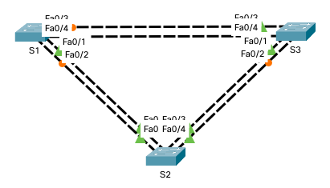

# Развертывание коммутируемой сети с резервными каналами

## Топология


## 1. Создание сети и настройка основных параметров устройства

### 1.1 Создайте сеть согласно топологии




### 1.2 Выполните инициализацию и перезагрузку коммутаторов.

...

### 1.3 Настройте базовые параметры каждого коммутатора.


> a. Отключите поиск DNS.
> b. Присвойте имена устройствам в соответствии с топологией.
> c. Назначьте class в качестве зашифрованного пароля доступа к привилегированному режиму.
> d. Назначьте cisco в качестве паролей консоли и VTY и активируйте вход для консоли и VTY каналов.
> e. Настройте logging synchronous для консольного канала.
> f. Настройте баннерное сообщение дня (MOTD) для предупреждения пользователей о запрете несанкционированного доступа.
> g. Задайте IP-адрес, указанный в таблице адресации для VLAN 1 на всех коммутаторах.
> h. Скопируйте текущую конфигурацию в файл загрузочной конфигурации.

**S1**

```shell
Switch>en
Switch#conf t
Enter configuration commands, one per line.  End with CNTL/Z.
Switch(config)#no ip domain-lookup 
Switch(config)#h S1
S1(config)#enable s class
S1(config)#li c 0
S1(config-line)#pas cisco
S1(config-line)#login
S1(config-line)#logg sync
S1(config-line)#exit
S1(config)#li vty 0 4
S1(config-line)#pas cisco
S1(config-line)#login
S1(config-line)#logg sync
S1(config-line)#exit
S1(config)#service password-encryption 
S1(config)#banner motd #Unauthorized access is strictly prohibited.#
S1(config)#interface vlan 1
S1(config-if)#ip address 192.168.1.1 255.255.255.0
S1(config-if)#no shutdown 

S1(config-if)#
%LINK-5-CHANGED: Interface Vlan1, changed state to up

%LINEPROTO-5-UPDOWN: Line protocol on Interface Vlan1, changed state to up

S1(config-if)#exit
S1(config)#exit
S1#
%SYS-5-CONFIG_I: Configured from console by console

S1#copy running-config startup-config 
Destination filename [startup-config]? 
Building configuration...
[OK]
S1#
```

**S2**

```shell
Switch>en
Switch#conf t
Enter configuration commands, one per line.  End with CNTL/Z.
Switch(config)#no ip domain-lookup
Switch(config)#h S2
S2(config)#ena s class
S2(config)#li c 0
S2(config-line)#pas cisco
S2(config-line)#login
S2(config-line)#logg sync
S2(config-line)#exit
S2(config)#li vty 0 4
S2(config-line)#pas cisco
S2(config-line)#login
S2(config-line)#logg sync
S2(config-line)#exit
S2(config)#se pas
S2(config)#banner motd #Unauthorized access is strictly prohibited.#
S2(config)#in v 1
S2(config-if)#ip address 192.168.1.2 255.255.255.0
S2(config-if)#no shu

S2(config-if)#
%LINK-5-CHANGED: Interface Vlan1, changed state to up

%LINEPROTO-5-UPDOWN: Line protocol on Interface Vlan1, changed state to up

S2(config-if)#end
S2#
%SYS-5-CONFIG_I: Configured from console by console

S2#copy running-config startup-config 
Destination filename [startup-config]? 
Building configuration...
[OK]
S2#
```

**S3**

```shell
Switch>en
Switch#conf t
Enter configuration commands, one per line.  End with CNTL/Z.
Switch(config)#no ip domain l
Switch(config)#h S3
S3(config)#ena s class
S3(config)#li c 0
S3(config-line)#pas cisco
S3(config-line)#login
S3(config-line)#logg sync
S3(config-line)#exit
S3(config)#li vty 0 4
S3(config-line)#pas cisco
S3(config-line)#login
S3(config-line)#logg sync
S3(config-line)#exit
S3(config)#se pas
S3(config)#banner motd #Unauthorized access is strictly prohibited.#
S3(config)#in v 1
S3(config-if)#ip address 192.168.1.3 255.255.255.0
S3(config-if)#no shu

S3(config-if)#
%LINK-5-CHANGED: Interface Vlan1, changed state to up

%LINEPROTO-5-UPDOWN: Line protocol on Interface Vlan1, changed state to up

S3(config-if)#end
S3#
%SYS-5-CONFIG_I: Configured from console by console

S3#copy running-config startup-config 
Destination filename [startup-config]? 
Building configuration...
[OK]
S3#
```

### 1.4 Проверьте связь.

**ping S1 -> S2, S2 -> S3**

```shell
S1>ping 192.168.1.2

Type escape sequence to abort.
Sending 5, 100-byte ICMP Echos to 192.168.1.2, timeout is 2 seconds:
..!!!
Success rate is 60 percent (3/5), round-trip min/avg/max = 0/0/0 ms

S1>ping 192.168.1.2

Type escape sequence to abort.
Sending 5, 100-byte ICMP Echos to 192.168.1.2, timeout is 2 seconds:
!!!!!
Success rate is 100 percent (5/5), round-trip min/avg/max = 0/0/0 ms

S1>ping 192.168.1.3

Type escape sequence to abort.
Sending 5, 100-byte ICMP Echos to 192.168.1.3, timeout is 2 seconds:
..!!!
Success rate is 60 percent (3/5), round-trip min/avg/max = 0/0/0 ms

S1>ping 192.168.1.3

Type escape sequence to abort.
Sending 5, 100-byte ICMP Echos to 192.168.1.3, timeout is 2 seconds:
!!!!!
Success rate is 100 percent (5/5), round-trip min/avg/max = 0/2/8 ms

S1#
```

**ping S2 -> S3**

```shell
S2#ping 192.168.1.3

Type escape sequence to abort.
Sending 5, 100-byte ICMP Echos to 192.168.1.3, timeout is 2 seconds:
..!!!
Success rate is 60 percent (3/5), round-trip min/avg/max = 0/0/0 ms

S2#ping 192.168.1.3

Type escape sequence to abort.
Sending 5, 100-byte ICMP Echos to 192.168.1.3, timeout is 2 seconds:
!!!!!
Success rate is 100 percent (5/5), round-trip min/avg/max = 0/0/4 ms

S2#
```

Проверьте способность компьютеров обмениваться эхо-запросами.

- Успешно ли выполняется эхо-запрос от коммутатора S1 на коммутатор S2? - **ДА**  
- Успешно ли выполняется эхо-запрос от коммутатора S1 на коммутатор S3? - **ДА**  
- Успешно ли выполняется эхо-запрос от коммутатора S2 на коммутатор S3? - **ДА**  

Выполняйте отладку до тех пор, пока ответы на все вопросы не будут положительными.

## 2. Определение корневого моста

### 2.1 Отключите все порты на коммутаторах.

**S1**

```shell
Unauthorized access is strictly prohibited.

User Access Verification

Password: 

S1>en
Password: 

S1#conf t
Enter configuration commands, one per line.  End with CNTL/Z.
S1(config)#in r f0/1-4
S1(config-if-range)#shutdown


S1(config-if-range)#
%LINK-5-CHANGED: Interface FastEthernet0/1, changed state to administratively down

%LINEPROTO-5-UPDOWN: Line protocol on Interface FastEthernet0/1, changed state to down

%LINK-5-CHANGED: Interface FastEthernet0/2, changed state to administratively down

%LINEPROTO-5-UPDOWN: Line protocol on Interface FastEthernet0/2, changed state to down

%LINK-5-CHANGED: Interface FastEthernet0/3, changed state to administratively down

%LINEPROTO-5-UPDOWN: Line protocol on Interface FastEthernet0/3, changed state to down

%LINK-5-CHANGED: Interface FastEthernet0/4, changed state to administratively down

%LINEPROTO-5-UPDOWN: Line protocol on Interface FastEthernet0/4, changed state to down

%LINEPROTO-5-UPDOWN: Line protocol on Interface Vlan1, changed state to down

S1(config-if-range)#
```

**S2**

```shell
Unauthorized access is strictly prohibited.

User Access Verification

Password: 

S2>en
Password: 
S2#conf t
Enter configuration commands, one per line.  End with CNTL/Z.
S2(config)#in r f0/1-4
S2(config-if-range)#shutdown

%LINK-5-CHANGED: Interface FastEthernet0/1, changed state to administratively down

%LINK-5-CHANGED: Interface FastEthernet0/2, changed state to administratively down


S2(config-if-range)#
%LINK-5-CHANGED: Interface FastEthernet0/3, changed state to administratively down

%LINEPROTO-5-UPDOWN: Line protocol on Interface FastEthernet0/3, changed state to down

%LINK-5-CHANGED: Interface FastEthernet0/4, changed state to administratively down

%LINEPROTO-5-UPDOWN: Line protocol on Interface FastEthernet0/4, changed state to down

%LINEPROTO-5-UPDOWN: Line protocol on Interface Vlan1, changed state to down

S2(config-if-range)#
```

**S3**

```shell
Unauthorized access is strictly prohibited.

User Access Verification

Password: 

S3>en
Password: 
S3#conf t
Enter configuration commands, one per line.  End with CNTL/Z.
S3(config)#in r f0/1-4
S3(config-if-range)#shutdown

%LINK-5-CHANGED: Interface FastEthernet0/1, changed state to administratively down

%LINK-5-CHANGED: Interface FastEthernet0/2, changed state to administratively down

%LINK-5-CHANGED: Interface FastEthernet0/3, changed state to administratively down

%LINK-5-CHANGED: Interface FastEthernet0/4, changed state to administratively down
S3(config-if-range)#
```

### 2.2 Настройте подключённые порты в качестве транковых.

**S1**

```shell
S1#conf t
Enter configuration commands, one per line.  End with CNTL/Z.
S1(config)#in range f0/1-4
S1(config-if-range)#swi
S1(config-if-range)#switchport mode trunk
S1(config-if-range)#exit
S1(config)#
```

**S2**

```shell
S2#conf t
Enter configuration commands, one per line.  End with CNTL/Z.
S2(config)#in range f0/1-4
S2(config-if-range)#switchport mode trunk
S2(config-if-range)#exit
S2(config)#
```

**S3**

```shell
S3#conf t
Enter configuration commands, one per line.  End with CNTL/Z.
S3(config)#in range f0/1-4
S3(config-if-range)#switchport mode trunk
S3(config-if-range)#exit
S3(config)#
```

### 2.3 Включите порты F0/2 и F0/4 на всех коммутаторах.

**S1**

```shell
S1(config)#in r f0/2, f0/4
S1(config-if-range)#no shutdown

%LINK-5-CHANGED: Interface FastEthernet0/2, changed state to down

%LINK-5-CHANGED: Interface FastEthernet0/4, changed state to down
S1(config-if-range)#
```

**S2**

```shell
S2(config)#in r f0/2, f0/4
S2(config-if-range)#no shutdown


%LINK-5-CHANGED: Interface FastEthernet0/4, changed state to down
S2(config-if-range)#
%LINK-5-CHANGED: Interface FastEthernet0/2, changed state to up

%LINEPROTO-5-UPDOWN: Line protocol on Interface FastEthernet0/2, changed state to up

%LINEPROTO-5-UPDOWN: Line protocol on Interface Vlan1, changed state to up

S2(config-if-range)#
```

**S3**

```shell
S3(config)#in r f0/2, f0/4
S3(config-if-range)#no shutdown


S3(config-if-range)#
%LINK-5-CHANGED: Interface FastEthernet0/2, changed state to up

%LINEPROTO-5-UPDOWN: Line protocol on Interface FastEthernet0/2, changed state to up

%LINEPROTO-5-UPDOWN: Line protocol on Interface Vlan1, changed state to up

%LINK-5-CHANGED: Interface FastEthernet0/4, changed state to up

%LINEPROTO-5-UPDOWN: Line protocol on Interface FastEthernet0/4, changed state to up

S3(config-if-range)#
```

### 2.4 Отобразите данные протокола spanning-tree.

**S1**

```shell
S1#show spanning-tree 
VLAN0001
  Spanning tree enabled protocol ieee
  Root ID    Priority    32769
             Address     0001.631E.051E
             Cost        19
             Port        2(FastEthernet0/2)
             Hello Time  2 sec  Max Age 20 sec  Forward Delay 15 sec

  Bridge ID  Priority    32769  (priority 32768 sys-id-ext 1)
             Address     00E0.F78E.7CDB
             Hello Time  2 sec  Max Age 20 sec  Forward Delay 15 sec
             Aging Time  20

Interface        Role Sts Cost      Prio.Nbr Type
---------------- ---- --- --------- -------- --------------------------------
Fa0/2            Root FWD 19        128.2    P2p
Fa0/4            Altn BLK 19        128.4    P2p

S1#
```

**S2**

```shell
S2#show spanning-tree 
VLAN0001
  Spanning tree enabled protocol ieee
  Root ID    Priority    32769
             Address     0001.631E.051E
             This bridge is the root
             Hello Time  2 sec  Max Age 20 sec  Forward Delay 15 sec

  Bridge ID  Priority    32769  (priority 32768 sys-id-ext 1)
             Address     0001.631E.051E
             Hello Time  2 sec  Max Age 20 sec  Forward Delay 15 sec
             Aging Time  20

Interface        Role Sts Cost      Prio.Nbr Type
---------------- ---- --- --------- -------- --------------------------------
Fa0/2            Desg FWD 19        128.2    P2p
Fa0/4            Desg FWD 19        128.4    P2p

S2#
```

**S3**

```shell
S3#show spanning-tree 
VLAN0001
  Spanning tree enabled protocol ieee
  Root ID    Priority    32769
             Address     0001.631E.051E
             Cost        19
             Port        2(FastEthernet0/2)
             Hello Time  2 sec  Max Age 20 sec  Forward Delay 15 sec

  Bridge ID  Priority    32769  (priority 32768 sys-id-ext 1)
             Address     0002.167D.364E
             Hello Time  2 sec  Max Age 20 sec  Forward Delay 15 sec
             Aging Time  20

Interface        Role Sts Cost      Prio.Nbr Type
---------------- ---- --- --------- -------- --------------------------------
Fa0/2            Root FWD 19        128.2    P2p
Fa0/4            Desg FWD 19        128.4    P2p

S3#
```

**С учетом выходных данных, поступающих с коммутаторов, ответьте на следующие вопросы.**

> Какой коммутатор является корневым мостом?

S2

> Почему этот коммутатор был выбран протоколом spanning-tree в качестве корневого моста?

Все коммутаторы в данной сети находятся в одном VLAN (VLAN 1) и имеют один (дефолтный) приоритет. Поэтому в качестве root-bridge был выбран коммутатор с наименьшим MAC.

S1: MAC value: hex -> 00E0F78E7CDB, dec -> 966225984731
S2: MAC value: hex -> 0001631E051E, dec -> 5957879070 <- MIN VALUE
S3: MAC value: hex -> 0002167D364E, dec -> 8967239246

> Какие порты на коммутаторе являются корневыми портами?

??? почему везде cost - 19?

root-порты могут иметь только некорневые коммутаторы. root-портом выбирается порт, ближайший к корневому коммутатору по критерию "стоимость корневого маршрута".
Таковыми являются порт Fa0/2 на коммутаторе S1 и порт Fa0/2 на коммутаторе S3.

> Какие порты на коммутаторе являются назначенными портами?

- На корневом коммутаторе все порты являются назначенными.
- Если на одном конце соединения корневой порт (или оконечное устройство), то на другом - назначенный.
- Если на обоих концах соединения - некорневые порты, то назначенным из них выбирается порт, ближайший к корневому коммутатору по критерию "стоимость корневого маршрута".

> Какой порт отображается в качестве альтернативного и в настоящее время заблокирован?

Альтернативным выбирается порт, который не является ни корневым, ни назначенным.  
Таковым является порт Fa0/4 коммутатора S1.

> Почему протокол spanning-tree выбрал этот порт в качестве невыделенного (заблокированного) порта?

Определяется по критериям:

- Lowest sender BID - **по этому критерию выбран порт Fa0/4 коммутатора S1**
- Lowest sender port priority (configurable; default - 128)
- Lowest sender port ID

??? разобрать

## 3. Наблюдение за процессом выбора протоколом STP порта, исходя из стоимости портов.

### 3.1 Определите коммутатор с заблокированным портом.

см. пункт 2.4

### 3.2 Измените стоимость порта.

```shell
S1(config)#interface f0/2
S1(config-if)#spanning-tree cost 18
S1(config-if)#end
S1#
%SYS-5-CONFIG_I: Configured from console by console

S1#
```

### 3.3 Посмотрите изменения протокола spanning-tree.

*Повторно выполните команду show spanning-tree на обоих коммутаторах некорневого моста. Обратите внимание, что ранее заблокированный порт (S1 – F0/4) теперь является назначенным портом, и протокол spanning-tree теперь блокирует порт на другом коммутаторе некорневого моста (S3 – F0/4).*

??? Ничего не изменилось.

**S1**

```shell
S1#show spanning-tree 
VLAN0001
  Spanning tree enabled protocol ieee
  Root ID    Priority    32769
             Address     0001.631E.051E
             Cost        19
             Port        2(FastEthernet0/2)
             Hello Time  2 sec  Max Age 20 sec  Forward Delay 15 sec

  Bridge ID  Priority    32769  (priority 32768 sys-id-ext 1)
             Address     00E0.F78E.7CDB
             Hello Time  2 sec  Max Age 20 sec  Forward Delay 15 sec
             Aging Time  20

Interface        Role Sts Cost      Prio.Nbr Type
---------------- ---- --- --------- -------- --------------------------------
Fa0/2            Root FWD 19        128.2    P2p
Fa0/4            Altn BLK 19        128.4    P2p

S1#
```

**S3**

```shell
S3#show spanning-tree 
VLAN0001
  Spanning tree enabled protocol ieee
  Root ID    Priority    32769
             Address     0001.631E.051E
             Cost        19
             Port        2(FastEthernet0/2)
             Hello Time  2 sec  Max Age 20 sec  Forward Delay 15 sec

  Bridge ID  Priority    32769  (priority 32768 sys-id-ext 1)
             Address     0002.167D.364E
             Hello Time  2 sec  Max Age 20 sec  Forward Delay 15 sec
             Aging Time  20

Interface        Role Sts Cost      Prio.Nbr Type
---------------- ---- --- --------- -------- --------------------------------
Fa0/4            Desg FWD 19        128.4    P2p
Fa0/2            Root FWD 19        128.2    P2p

S3#
```

> Почему протокол spanning-tree заменяет ранее заблокированный порт на назначенный порт и блокирует порт, который был назначенным портом на другом коммутаторе?

???

### 3.4 Удалите изменения стоимости порта.


> a Выполните команду no spanning-tree cost 18 режима конфигурации интерфейса, чтобы удалить запись стоимости, созданную ранее.

```shell
S1(config)#interface f0/2
S1(config-if)#no spanning-tree cost 18
S1(config-if)#exit
S1(config)#
```

> b Повторно выполните команду show spanning-tree, чтобы подтвердить, что протокол STP сбросил порт на коммутаторе некорневого моста, вернув исходные настройки порта. Протоколу STP требуется примерно 30 секунд, чтобы завершить процесс перевода порта.

```shell
S1(config)#do show spanning-tree
VLAN0001
  Spanning tree enabled protocol ieee
  Root ID    Priority    32769
             Address     0001.631E.051E
             Cost        19
             Port        2(FastEthernet0/2)
             Hello Time  2 sec  Max Age 20 sec  Forward Delay 15 sec

  Bridge ID  Priority    32769  (priority 32768 sys-id-ext 1)
             Address     00E0.F78E.7CDB
             Hello Time  2 sec  Max Age 20 sec  Forward Delay 15 sec
             Aging Time  20

Interface        Role Sts Cost      Prio.Nbr Type
---------------- ---- --- --------- -------- --------------------------------
Fa0/2            Root FWD 19        128.2    P2p
Fa0/4            Altn BLK 19        128.4    P2p

S1(config)#
```

## 4. Наблюдение за процессом выбора протоколом STP порта, исходя из приоритета портов


> a Включите порты F0/1 и F0/3 на всех коммутаторах.

**S1**

```shell
S1(config)#in r f0/1, f0/3
S1(config-if-range)#no shutdown

%LINK-5-CHANGED: Interface FastEthernet0/1, changed state to down

%LINK-5-CHANGED: Interface FastEthernet0/3, changed state to down
S1(config-if-range)#
```

**S3**

```shell
S3(config)#in r f0/1, f0/3
S3(config-if-range)#no shutdown

%LINK-5-CHANGED: Interface FastEthernet0/1, changed state to down

S3(config-if-range)#
```

**S2**

```shell
S2(config)#in r f0/1, f0/3
S2(config-if-range)#no shutdown


S2(config-if-range)#
%LINK-5-CHANGED: Interface FastEthernet0/1, changed state to up

%LINEPROTO-5-UPDOWN: Line protocol on Interface FastEthernet0/1, changed state to up

%LINK-5-CHANGED: Interface FastEthernet0/3, changed state to up

%LINEPROTO-5-UPDOWN: Line protocol on Interface FastEthernet0/3, changed state to up

S2(config-if-range)#
```

> b Подождите 30 секунд, чтобы протокол STP завершил процесс перевода порта, после чего выполните команду show spanning-tree на коммутаторах некорневого моста. Обратите внимание, что порт корневого моста переместился на порт с меньшим номером, связанный с коммутатором корневого моста, и заблокировал предыдущий порт корневого моста.

**S1**

```shell
S1#show spanning-tree 
VLAN0001
  Spanning tree enabled protocol ieee
  Root ID    Priority    32769
             Address     0001.631E.051E
             Cost        19
             Port        1(FastEthernet0/1)
             Hello Time  2 sec  Max Age 20 sec  Forward Delay 15 sec

  Bridge ID  Priority    32769  (priority 32768 sys-id-ext 1)
             Address     00E0.F78E.7CDB
             Hello Time  2 sec  Max Age 20 sec  Forward Delay 15 sec
             Aging Time  20

Interface        Role Sts Cost      Prio.Nbr Type
---------------- ---- --- --------- -------- --------------------------------
Fa0/1            Root FWD 19        128.1    P2p
Fa0/2            Altn BLK 19        128.2    P2p
Fa0/4            Altn BLK 19        128.4    P2p
Fa0/3            Altn BLK 19        128.3    P2p

S1#
```

**S3**

```shell
S3#show spanning-tree 
VLAN0001
  Spanning tree enabled protocol ieee
  Root ID    Priority    32769
             Address     0001.631E.051E
             Cost        19
             Port        1(FastEthernet0/1)
             Hello Time  2 sec  Max Age 20 sec  Forward Delay 15 sec

  Bridge ID  Priority    32769  (priority 32768 sys-id-ext 1)
             Address     0002.167D.364E
             Hello Time  2 sec  Max Age 20 sec  Forward Delay 15 sec
             Aging Time  20

Interface        Role Sts Cost      Prio.Nbr Type
---------------- ---- --- --------- -------- --------------------------------
Fa0/3            Desg FWD 19        128.3    P2p
Fa0/4            Desg FWD 19        128.4    P2p
Fa0/1            Root FWD 19        128.1    P2p
Fa0/2            Altn BLK 19        128.2    P2p

S3#
```

> Какой порт выбран протоколом STP в качестве порта корневого моста на каждом коммутаторе некорневого моста?

???

> Почему протокол STP выбрал эти порты в качестве портов корневого моста на этих коммутаторах?

???

## Вопросы для повторения

> 1 Какое значение протокол STP использует первым после выбора корневого моста, чтобы определить выбор порта?

???

> 2 Если первое значение на двух портах одинаково, какое следующее значение будет использовать протокол STP при выборе порта?
 
???

> 3 Если оба значения на двух портах равны, каким будет следующее значение, которое использует протокол STP при выборе порта?

???
